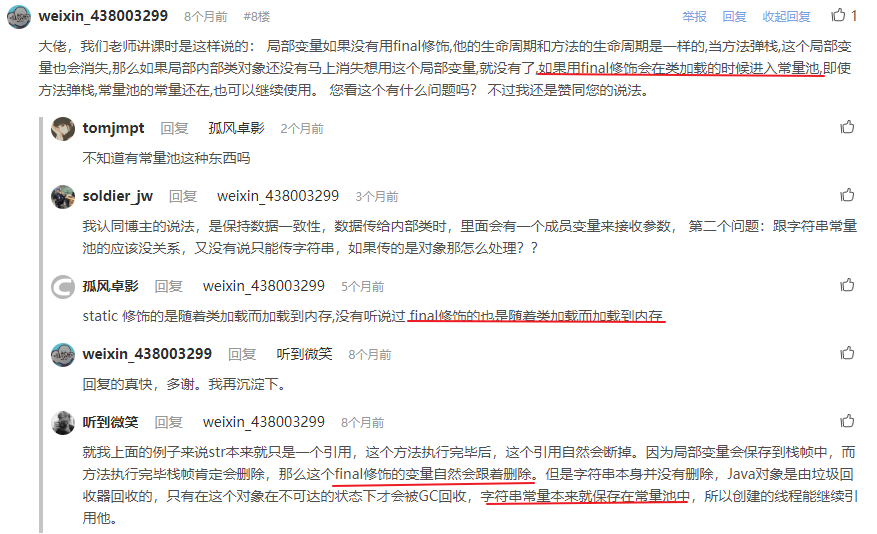
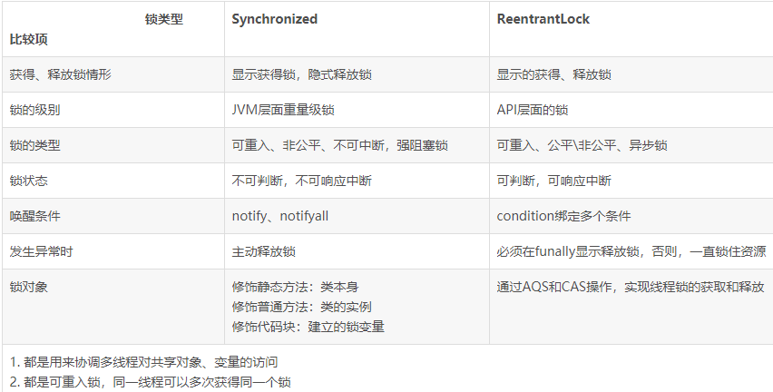
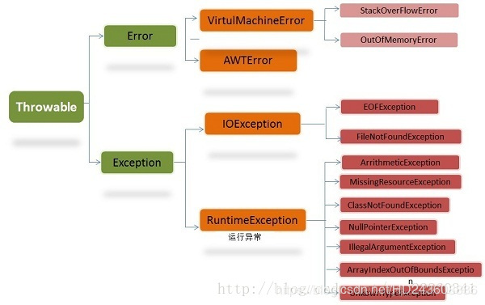
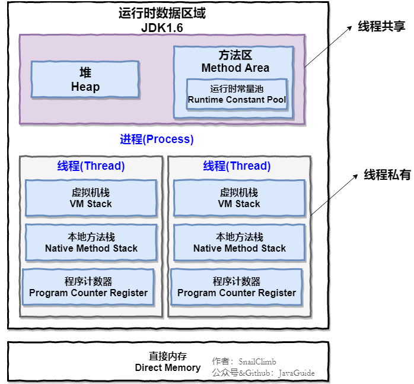
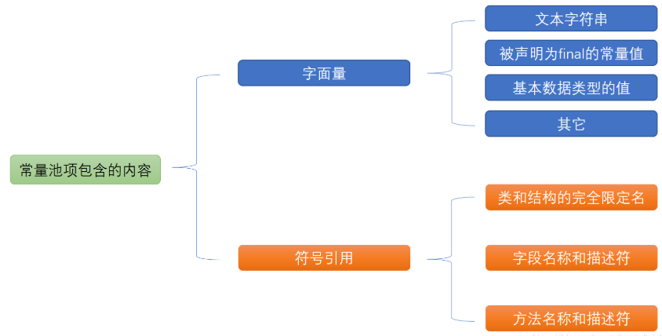
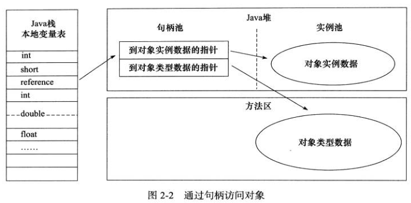
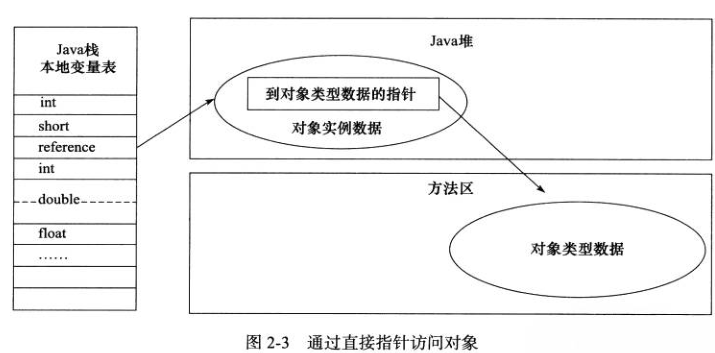

## 1. 内部类访问局部变量时，局部变量为何必须要通过final修饰

内部类如何实现访问局部变量?  
底层会将该变量作为**参数**传递给内部类构造函数。  
如果编译期可以确定变量的值则直接在匿名内部类中创建拷贝；如果不能确定则以参数进行传递。
**参考文章: https://www.runoob.com/w3cnote/java-inner-class-intro.html**  
  
通过final修饰的原因是  
**保证数据的一致性**  
把变量修饰成final类型，在程序运行过程中不会被修改。因此final可以保证数据一致性，对于基本类型是指值的一致性，对于对象是指引用地址的一致性。  
防止变量在函数中被修改，而对象中使用旧的值造成的不一致现象。  
因为内部类对象在使用局部变量时是把它当成同一个变量来使用的，并不知道其实使用的是一个传递过去的参数。  

在JDK8中，可以不通过final修饰，这是一个语法糖，final通过底层加入。此时这个局部变量仍然无法修改，否则会报错。  

另一个解释是
**内部类可以访问到局部变量，而局部变量和内部类对象生命周期不一致之间的矛盾** 
局部变量在方法执行完毕后会被释放，而此时对象不一定，那么就会出现对象访问了一个不存在的变量。  
final修饰之后可以解决这一矛盾吗？好像不能
  

参考博客：https://blog.csdn.net/tianjindong0804/article/details/81710268  

## 静态内部类与内部类
**参考文章： https://blog.csdn.net/vcliy/article/details/85235363**
- 内部类实例化必须先实例化外部类对象，然后通过外部类实例再new内部类对象
``` java
Outer.Inner in = new Outer.new Inner();
```
- 内部类可以访问外部类的所有属性，包括私有属性
- 内部类不可以定义static元素，
静态内部类是一种特殊的内部类，Java文档中描述：一个内部类被static修饰时，它就升级为顶级类，简单的说，除了静态内部类位于其他类内部之外，它具有一个普通类的所有性质
- 静态内部类实例化，不需要先new一个外部类
``` java
Outer.StaticInner in = new Outer.StaticInner();
```
- 静态内部类可以定义static属性
- 静态内部类不能访问外部类的非静态成员

## 2. Synchronized 和 Lock的区别
Java 5之后, java.util.concurrent 提供了Lock接口和一些实现类来实现同步访问。它跟Java关键字synchronized都是通过加锁来实现同步访问，保障线程安全。
为了更好地使用它们，需要了解它们之间的区别。  

1. Lock是一个接口，而synchronized是Java的关键字,由内置语言实现。  
 
2. synchronized的加锁和释放锁都是自动实现的；Lock需要手动加锁和释放锁，如果锁由于异常没有释放，容易导致死锁，一般需要在finally语句块中进行释放。  

3. Lock具有更大的灵活性，意味着可以实现更多地功能。比如在多线程读写时，由于写操作和读写操作不能同时进行，如果通过synchronized加锁，那么在保证读写安全时，也限制了单纯的读操作也不能并行，实际上多线程多操作是不会出现线程安全问题的，而使用Lock接口就不会有这个问题，允许多线程读操作同时进行，ReadAndWriteLock类就是实现了相关锁的类。  
Lock可以让等待线程响应中断，超时退出等待，是否获得锁可以查询等，这些使用synchronized是不行的  

4. 在Java6之前，synchronized是重量级的锁，锁操作的代价比较大，在一个线程获取锁后，其他竞争的线程会被阻塞直到获得锁。
不过在Java6中，synchronized也进行了一些优化，加入了适应自旋，锁消除，锁粗化，轻量级锁，偏向锁等等。导致在Java6上synchronize的性能并不比Lock差。

**synchonized修饰静态方法时，锁对象是类本身，所有类的实例共用一把锁(所有类产生的对象共用这个静态方法)**

## 3. ConcurrentHashMap是怎样实现线程安全的
在Java8之前，ConcurrentHashMap是通过将HashMap分段(Segment)，然后分别加锁来实现不同段的并发访问的。  
在Java8中，Segment仍然保留，但未使用，但插入时使用了synchronized+CAS操作，实现了更细粒度的加锁。   


## 4. 什么是消息队列
**参考文章:  https://developer.51cto.com/art/201904/595020.htm**
消息队列首先是一种队列，其中用于存储信息。  

### 消息队列的使用有下面的好处
1. 解耦
一般往消息队列中插入数据的叫做**生产者**，从消息队列取数据的叫做**消费者**。  
比如说存在生产者A和消费者B,C。在没有消息队列时，A需要向B和C传递数据，当B和C不再需要数据时，A的接口需要做相应的修改，或者消费者增加是要同时对新的消费者进行服务，这样维护会比较麻烦。  
当使用消息队列时，可以实现了生产者和消费者的解耦，A只需要把生产的数据放入消息队列，消费者也是从消息队列中获取数据，A不需要考虑其他消费者是否需要数据，消费者增加或减少。

2. 异步
当系统中不存在消息队列时，生产者产生的数据需要分别访问消费者的接口，然后才能继续接下来的任务，这是一种同步的工作方式，会影响生产者的工作效率。  
使用消息队列后，A只需要生产数据，放到消息队列中，然后就接着执行后面的任务，不需要调用B，C的接口等待结果。
实现更高的吞吐量。

3. 削峰,限流
当系统处理高并发访问时,如果不存在消息队列，所有访问直接通向处理的系统，如果访问超过系统最大负荷的话会使系统崩溃。  
如果我们把任务放到消息队列中，那么系统就只需要根据自己的处理能力来处理访问，刻意处理任务就从消息队列中获取数据。在高并发访问时仍然能够正常的工作。  
服务器的软件**负载均衡**就是通过分发消息队列来实现的。

### 为啥要实现消息队列中间件
Java中已经提供了许多种队列实现，我们仍然要实现消息队列中间件的原因  
1. 高可用
为了保证队列的可靠性，不能使用单机的消息队列，否则该系统故障后，整个系统无法工作。消息队列需要集群/分布式。
2. 数据丢失问题
为了防止数据丢失，我们需要实现数据的存储，当系统崩溃时不至于丢失数据。
3. 消费者获取队列方式
A提醒消费者获取还是消费者主动查询，有数据便获取。

这些都是消息队列需要考虑的问题，而Java的队列实现不能满足如此复杂的需求。


## 5. HashMap什么时候需要重写hashcode和equals
**参考文章:https://www.cnblogs.com/yangqiong1989/p/10795049.html**  
**Object源码中有hashcode实现原则**  
当HashMap需要使用自定义的类作为键的时候，或者对象当前的hashcode值。  
默认的类方法中equals和hashcode(native 方法)继承自object，equals是比较对象引用是否相等  

同时hashcode的实现有下面三个原则：
#### 1. 同一个应用程序，在一次执行中，多次计算同一个对象的hashcode值必须相等。在多次执行应用程序，返回的hashcode不要求相等。
#### 2. equals相等的对象，hashcode值必须相等。
#### 3. equals不相等的对象，hashcode值不必一定不同。但equals不相等的对象具有不同的hashcode表示有很好的散列性能。

**由原则2可知，原来的hashcode只能保证在对象equals相等，即引用地址相同时才返回相同的hash值。**  

当不同引用的对象具有相同的某些属性值时，我们在hash时一般需要把他们映射到同一个hashcode上，这时需要重写hashcode方法来实现。如果我们只重写hashcode而不重写equals，会导致第二个原则无法满足。所以应该同时重写hashcode和equals，保持equals和hashcode在使用的属性上保持一致。

Java.util.HashCode在put元素时，首先根据hashcode值与一个设定值异或来将它对应到数组索引处，如果该位置上没有元素，则直接作为链表节点插入；如果该位置有对象，判断hashcode是否相同，如果相同，判断equals是否相同，形同则进行值的更新，不相等则插入到链表的首部。

## 6. ArrayList和LinkedList底层实现有什么差别？它们各自适用于哪些场合？

ArrayList底层通过动态数组实现，LinkedList底层是通过双向链表来实现，
这意味着ArrayList在按索引查找上可以实现O(1)的时间复杂度，而基于数组实现表示增加和删除元素代价相对较高。倒台数组是指，当数组中的元素查过一定的阈值时，还需要对数组进行扩容，此时需要将整个List的元素进行迁移。
## **增加具体的扩容数据**  
而LinkedList在增加和删除元素时相对便捷，只需要修改链表的指针即可，同时不存在扩容操作，避免了扩容时元素的迁移。但基于链表的查找操作需要遍历链表，时间复杂度是O(N)。不过由于LinkedList是基于双向链表，并且保存有链表收尾的指针，在按索引查找时可以选择从头还是尾来开始遍历，所以最多只需要遍历一半的元素。  
从它们各自的特点上，我们可以分析它们的使用场合，ArrayList适用于有大量索引查找操作，并且一般从末端插入的场景。
而LinkedList适用于有比较多的插入，删除操作场景。  

同时LinkedList还继承了Deque接口，有更大的灵活性，可以作为单端和双端队列使用，还可以作为栈。
但用于栈或队列时，推荐使用ArrayDeque，它拥有比LinkedList更好的性能(当作栈或队列使用时)。
因为ArrayDeque底层是基于循环数组实现的，对于栈和队列这种只在首尾操作元素的数据结构，基于数组的实现访问是常量的时间复杂度，省去了链表中把对象包装成节点的操作。

## 7. java异常


java异常继承自超类 Throwable，分为Error和Exception
其中Error包括内存溢出等，由虚拟机处理
Exception分为RuntimeException和一般异常
#### 1.可查异常和不可查异常  
不可查异常指RuntimeException及其子类和Error,这些异常在我们的程序中可以不处理，在异常出现时会从方法中逐层抛出，最后退出线程或主线程。
可查异常,除RuntimeException类之外，其他的Exception及其子类都属于可查异常，这是我们必需要处理的异常，需要用try,catch语句捕获或者抛出，否则无法通过编译

#### 2. 运行时异常和非运行时异常
运行时异常是指RuntimeException及其子类，不严格要求特别的处理
非运行时异常，可查异常

## 8. & 与 &&
&& 表示逻辑与  
& 表示按位与和逻辑与  
表示逻辑与时，&是长路与，两个逻辑量都会判断  
&&是短路与，如果第一个是false，则不判断第二个逻辑量，直接返回false  

## 9. HashMap 与 HashTable; Hashmap的排序
1. HashMap与HashTable的区别
源码中的一句话
``` java
 * (The {@code HashMap} class is roughly equivalent to {@code Hashtable}, except that it is
 * unsynchronized and permits nulls.)
```
HashMap不是线程安全的，且允许key和value中出现null  
HashTable是线程安全的，不允许null  
2. HashMap的排序  
  1) 一般方法是将HashMap的键值对作为Entry存入ArrayList中，然后通过Collections.sort()方法对ArrayList进行排序，同时也可以传入Comparator来自定义排序。  
  2) 利用java8中新特性，通过流对集合进行处理，搭配lambda表达式。
``` java
map.stream().sorted(new Comparator<Map.Entry<Integer, People>>(){
    @Override
    public int compare(Map.Entry<Integer, People> a, Map.Entry<Integer, People> b){
        return a.getValue().getAge()-b.getValue().getAge();
    }
}).collect(Collectors.toList());
```

## 10. 幻读
SQL中对幻读的定义: 在两个连续的查找之间一个并发的修改事务修改了查询的数据集，导致这两个查询返回了不同的结果  
解决方法: 提高事务隔离级别为Serializable(串行化)

## 11. 进程和线程
#### 1. 进程
进程是程序的一次执行过程，一个程序的运行就是一个进程的创建、运行和关闭的过程  
在Java中，启动main函数就相当于创建一个JVM的进程，main函数所在的线程是这个进程中的一个线程，称为主线程。  
#### 2. 线程
线程是最小的执行单位，一个进程可以包含多个线程。  
与进程不同的是，进程下的多个进程共享进程的堆和方法区资源，但每个线程有自己的程序计数器、虚拟机栈和本地方法栈。  
程序在创建线程，或在线程之间切换时，负担要比进程小的多，所以线程又叫轻量化进程。  
#### 3. 为何每个线程都有私有的程序计数器、虚拟机栈和本地方法栈
**程序计数器:** 程序计数器用于指向字节码中要执行的命令位置，在多线程中，每个线程都要记录执行的位置，在线程切换时能接着之前的位置执行。**注意**如果在执行的是native方法，程序计数器记录的是undefine，而不是要执行的命令位置。  
**虚拟机栈:** 每一个方法在执行时都会创建一个栈帧用于存储局部变量表、操作数栈、常量池引用等信息。一个方法从调用到结束的过程，就是一个栈帧从入栈到出栈的过程。
**本地方法栈:** 和虚拟机栈的作用类似，不同是本地方法栈是在native方法执行使提供服务。
为了保证线程在执行时局部变量不被其他线程访问，其虚拟机栈和本地方法栈也都是私有的。

## 12. Java是单继承，多实现。 多继承有什么不好
**参考博客：https://blog.csdn.net/u014133299/article/details/77571912**
如果A和B类都有方法fun，但是有不同的实现。  
当C同时继承A和B，当它调用fun方法时，由于A和B中的实现不一致，会出现歧义  
使用多实现时，由于接口不包含方法具体的实现，不会出现这种矛盾。

## 13. abstract class 和 interface的区别

抽象类是通过被继承被使用 extends  
接口是通过实现被使用  implements  
  
抽象类是通过继承使用，所以一个类只能继承一个抽象类  
而一个类可以同时实现多个接口  
  
抽象类中可以有实例变量  
接口中只能有类变量(通过static修饰的变量)  
  
抽象类中可以实现方法，而接口中的方法没有实现。  
在java8中，接口中也允许实现方法，在方法前需要用default修饰，这种用法在java8中已经被广泛使用，比如List接口中的sort()方法  
对接口的这一改变会带来多继承中可能出现的一个问题，即继承的多个接口中有同一个方法的不同实现，会出现歧义。  
为避免这一情况，java中加入了以下的规则：  
**参考文章: https://www.cnblogs.com/sum-41/p/10878807.html**   
1. 类中的方法优先级最高，类或父类中声明的方法优先级高于任何声明为默认方法的优先级  
2. 在第一条无法判断时，子接口的优先级更高： 选择根据题的实现，认为继承的子接口中实现更具体  
3. 第二条也无法判断时，继承多个接口的类必须通过显式覆盖和调用期望的方法，显式的选择使用某一个默认方法  
第三条实现的方式：
``` java
public class c implements A, B{
//  A和B接口都实现了hello() 方法，并且A和B 没有继承关系，此时需要在C中显式的覆盖方法hello来指名期望方法或者自己实现
    public void hello(){
        B.super.hello();
    }
//  或者C自己实现
//    public void hello(){
//        System.out.println("Hello C");
//    }
}
```

## 14. abstract方法可以同时被static，native或synchronized修饰吗
都不可以  
static表示该方法可以通过类直接调用，不需要类实例，而abstract方法无法被直接调用，两者矛盾。  
native表示通过非java语言实现的方法，主要用于与外环境交互，这些方法需要有实现体，而abstract没有。  
synchronized防止该方法被多个线程同时访问，这表示该方法可以被调用，而abstract没有方法体，无法被调用。  
本质上abstract方法不能同时被这三个修饰符修饰的原因是相同的，由于abstract方法没有实现，无法直接被调用，所以用它们来修饰会产生一些矛盾。

## 15. 几种常见的Runtime Exception
 1. NullPointerException  空指针异常  
 2. IndexOutOfBoundException, ArrayIndexOutOfBoundeException   下标越界、数组下标越界异常  
 3. ClassCastException   强制类型转换异常  
 4. ArithmeticException  算术运算异常，比如除零  
 5. IllegalArgumentException   非法参数异常  
 6. NegtiveArrayIndexException 数组负下标异常  


## 16. Java反射机制介绍
**参考文章:https://snailclimb.gitee.io/javaguide/#/docs/essential-content-for-interview/PreparingForInterview/%E5%BA%94%E5%B1%8A%E7%94%9F%E9%9D%A2%E8%AF%95%E6%9C%80%E7%88%B1%E9%97%AE%E7%9A%84%E5%87%A0%E9%81%93Java%E5%9F%BA%E7%A1%80%E9%97%AE%E9%A2%98?id=_52-%e9%9d%99%e6%80%81%e7%bc%96%e8%af%91%e5%92%8c%e5%8a%a8%e6%80%81%e7%bc%96%e8%af%91  
https://segmentfault.com/a/1190000010162647?utm_source=tuicool&utm_medium=referral**
**介绍:** 反射是指在运行时，可以获得任意类和对象的所有方法和属性。  
**优缺点:** 利用反射机制，可以动态的加载类，提高代码的灵活度，缺点是反射相当于一系列解释操作，通知 JVM 要做的事情，性能比直接的Java代码慢很多。  
**应用场景** 反射是Java框架的基石，在框架中大量使用了反射机制。例如:
 - JDBC中通过Class.forName()反射加载数据库驱动程序。
 - Spring中通过xml配置Bean信息后，通过反射动态加载类，然后实例化类

得到Class对象的方式
- 调用对象的getClass方法
- 通过Class类的静态方法forName
- 调用类的class属性


## 17. JVM，JDK和JRE
**参考文章:https://snailclimb.gitee.io/javaguide/#/docs/essential-content-for-interview/PreparingForInterview/%E5%BA%94%E5%B1%8A%E7%94%9F%E9%9D%A2%E8%AF%95%E6%9C%80%E7%88%B1%E9%97%AE%E7%9A%84%E5%87%A0%E9%81%93Java%E5%9F%BA%E7%A1%80%E9%97%AE%E9%A2%98?id=_52-%e9%9d%99%e6%80%81%e7%bc%96%e8%af%91%e5%92%8c%e5%8a%a8%e6%80%81%e7%bc%96%e8%af%91**
#### 1. JVM
Java代码经过编译转化为字节码，即.class文件，字节码文件由JVM加载并解释执行，JVM在不同系统平台有不同的版本，字节码和JVM是Java实现“一次编译，到处运行”的关键。  
**字节码的好处:** 避免了解释性语言效率低的缺点(字节码已经过编译和部分优化)，同时又有比较好的可移植性。  
根据二八定律，程序中耗时最久的只是少部分代码，这本分称为**热点代码**，为了更好地性能，引入了JIT,对热点代码进行编译并将机器码保存下来。优化程序效率。
#### 2. JDK和JRE
JDK是完整的Java开发工具包，它包含JRE中所有的内容，它还有编译器javac，和其他工具javadoc等。可以进行java代码的创建、编译和执行。  
JRE是java运行时环境，包含运行已编译的java程序的内容集合，包含JVM，java类库，java命令。但不能用于创建新程序。  


## 18. 并发和并行   什么是上下文切换
**参考文章:https://snailclimb.gitee.io/javaguide/#/docs/essential-content-for-interview/PreparingForInterview/%E5%BA%94%E5%B1%8A%E7%94%9F%E9%9D%A2%E8%AF%95%E6%9C%80%E7%88%B1%E9%97%AE%E7%9A%84%E5%87%A0%E9%81%93Java%E5%9F%BA%E7%A1%80%E9%97%AE%E9%A2%98?id=_52-%e9%9d%99%e6%80%81%e7%bc%96%e8%af%91%e5%92%8c%e5%8a%a8%e6%80%81%e7%bc%96%e8%af%91**
**并发**: 同一时间段内，多个任务都在执行，不一定同时执行  
**并行**: 多个任务同时执行  
**上下文切换**: 一般系统中的线程数一定大于cpu个数，而一个cpu在一个时间点上只能执行一个线程，为了使多个线程都有效工作，cpu为每个线程分配时间片来执行，当一个线程的时间片用完时，切换到下一个线程，此时会发生一次上下文切换。
需要保存当前线程的运行状态，同时加载下一个线程的运行状态。


## 19. 什么是死锁 如何避免死锁？
**参考文章:https://snailclimb.gitee.io/javaguide/#/docs/essential-content-for-interview/PreparingForInterview/%E5%BA%94%E5%B1%8A%E7%94%9F%E9%9D%A2%E8%AF%95%E6%9C%80%E7%88%B1%E9%97%AE%E7%9A%84%E5%87%A0%E9%81%93Java%E5%9F%BA%E7%A1%80%E9%97%AE%E9%A2%98?id=_52-%e9%9d%99%e6%80%81%e7%bc%96%e8%af%91%e5%92%8c%e5%8a%a8%e6%80%81%e7%bc%96%e8%af%91**
线程都在等待资源被释放而被无限期的阻塞。  
比如a，b线程都占有对方需要的资源，在请求对方资源时都处于阻塞状态，形成收尾相连的环。  
**避免死锁的方法:** 
- 设定最长阻塞时间，获取不到资源时不再等待
- 设定资源最长持有时间，超过该时间释放资源


## 20. sleep()方法和wait()方法的相同点和不同点？
**参考文章:https://snailclimb.gitee.io/javaguide/#/docs/essential-content-for-interview/PreparingForInterview/%E5%BA%94%E5%B1%8A%E7%94%9F%E9%9D%A2%E8%AF%95%E6%9C%80%E7%88%B1%E9%97%AE%E7%9A%84%E5%87%A0%E9%81%93Java%E5%9F%BA%E7%A1%80%E9%97%AE%E9%A2%98?id=_52-%e9%9d%99%e6%80%81%e7%bc%96%e8%af%91%e5%92%8c%e5%8a%a8%e6%80%81%e7%bc%96%e8%af%91**
- 都会暂停当前线程的执行
- sleep不会释放锁，wait会释放锁
- 线程wait之后，需要获取同一个对象锁的线程调用notify或notifyAll方法来唤醒;线程sleep后，会在一定时间后被唤醒继续执行
- wait通常用于线程间交互，sleep用于暂停线程执行
- 调用sleep方法需要catch异常，wait不用


## 21. Java内存区域介绍
**参考文章:[Java内存区域](https://github.com/Snailclimb/JavaGuide/blob/3965c02cc0f294b0bd3580df4868d5e396959e2e/Java%E7%9B%B8%E5%85%B3/%E5%8F%AF%E8%83%BD%E6%98%AF%E6%8A%8AJava%E5%86%85%E5%AD%98%E5%8C%BA%E5%9F%9F%E8%AE%B2%E7%9A%84%E6%9C%80%E6%B8%85%E6%A5%9A%E7%9A%84%E4%B8%80%E7%AF%87%E6%96%87%E7%AB%A0.md)**  
Java运行时数据区，分为堆、方法区、程序计数器、虚拟机栈、本地方法栈

其中堆和方法区为线程共享，程序计数器、虚拟机栈和本地方法栈为线程私有。
#### 1. 程序计数器
由字节码解释器控制，用于指向下一条要运行的命令位置，控制程序运行。  
在多线程程序中，为了在线程切换时记录线程的运行位置，每一个线程都要有一个私有的程序计数器。  
可以总结出程序计数器的两个作用：
1） 控制程序的顺序、分支、跳转等执行。  
2） 记录线程的执行位置，为上下文切换提供支持  
**程序计数器是唯一一个不会出现OutOfMemberError错误的内存区，它随着线程的创建而创建，销毁而销毁。**
#### 2. 虚拟机栈
通常由一个个栈帧组成，栈帧中包含局部变量表、操作数栈、动态链接和方法出口信息等。JVM在每个方法执行时创建一个栈帧，方法的开始和执行完毕，对应一个栈帧的入栈和出栈。  
虚拟机栈会出现的内存异常有两个:  
1) StackOverFlowError 当线程请求栈的深度超过最大深度时，会出现该错误  
2) OutOfMemberError 虚拟机栈内存溢出
虚拟机栈也是线程私有的，与线程的生命周期相同。  
#### 3. 本地方法栈
类似于虚拟机栈，为线程私有，不同的是虚拟机栈为Java方法提供服务，本地方法栈为Native方法提供服务，也会出现虚拟机栈中会出现的内存异常。
#### 4. 堆
运行时数据区中最大的一块内存区域，用于存储实例化的对象，所有线程共享。  
Java堆是垃圾收集器管理的主要区域，在分代垃圾收集算法中，分为新生代和老年代。  
其中还有永久代区域，在Java8中永久代被元空间代替，元空间使用物理内存。
#### 5. 方法区
该区域与Java堆一样为所有线程共享的区域，用于存储加载的类信息、常量、静态变量和及时编译期编译后的代码等内容。
**运行时常量池:**  方法区中有一个区域被称为运行时常量池，其中存储编译期生成的**字面量**和**符号引用**
  
**字面量包含文本字符串、final修饰的常量、基本数据类型等**
**符号引用包含类和结构的完全限定名、字段名称和描述符、方法的名称和描述符**
  
**Java7 JVM中，运行时常量池从方法区中移到了Java堆中**  
#### 6. 直接内存
该内存区域不在Java虚拟机规范中定义。可以通过Native方法分配。


## 22. Java对象创建  内存布局  访问定位
**参考文章:[Java内存区域](https://github.com/Snailclimb/JavaGuide/blob/3965c02cc0f294b0bd3580df4868d5e396959e2e/Java%E7%9B%B8%E5%85%B3/%E5%8F%AF%E8%83%BD%E6%98%AF%E6%8A%8AJava%E5%86%85%E5%AD%98%E5%8C%BA%E5%9F%9F%E8%AE%B2%E7%9A%84%E6%9C%80%E6%B8%85%E6%A5%9A%E7%9A%84%E4%B8%80%E7%AF%87%E6%96%87%E7%AB%A0.md)**  
#### 1. Java对象创建的五个过程
**类加载检查:** JVM在new一个对象的时候，根据指令参数检查常量池中的符号引用。确定对象的类是否已经被加载、解析和初始化过。  

**内存分配:** 通过类加载检查之后，虚拟机开始为对象分配内存，对象所需的内存此时已经是确定的。分配内存的方法有**指针碰撞**和**空闲列表**两种，具体使用哪种要根据使用的垃圾收集算法来确定，因为垃圾收集算法决定了内存是否规整。  
如果使用“**标记-清理**”算法，那么内存是不规整的，需要使用空闲列表方式，该方式维护了一个标记可用内存的空闲列表，虚拟机从中选择一个连续的足够大的内容区域分配给对象。  
如果使用“**标记-复制**”算法，一次垃圾收集中，把不需要清理的对象全部移动到另一部分内存区域中。此时内存是规整的，可以使用指针碰撞方式，直接将没使用的内存区域指针移动一部分分配给对象。  
内存分配可能存在线程安全的问题，hotspot虚拟机通过**TLAB**和**CAS+失败重试**来为对象分配内存，保证对象的分配是线程安全的，TLAB是虚拟机为每一个线程在Java堆中分配了一段内存，当TLAB内存用尽时，再通过“CAS+失败重试”来为对象分配内存。

**初始化零值:** 该过程把分配的内存区域清零，这样可以保证生成的对象参数都有零值，不需要赋初值就可以直接使用。  

**设置对象头:** 对象初始化零值之后，要设置对象头信息，其中包括对象所属的类、如何找到该类、对象哈希值、分代年龄信息等，还有对象是否使用偏向锁。  

**执行init:** 以上工作完成之后，从虚拟机的视角来说，一个对象已经完成了，接下来会执行init方法，根据Java代码对对象进行初始化。 该init方法包含对象父类的属性初始化、语句块、构造函数和该类的属性初始化、语句块、构造函数。  

#### 2. 对象的内存布局
Java对象占用的内存可以分为三个部分  
**对象头:** 该部分存储对象所属的类、如何找到该类、对象哈希值、分代年龄和是否加锁等信息。  
**实例数据部分:** 这部分存储的才是对象的属性等实际信息。  
**对齐部分:** hotspot虚拟机要求对象的总内存需要是8字节的整数倍，否则需要进行对齐占位。  

#### 3. 对象的访问定位
Java实例变量中存储的是对象的reference，访问时根据reference定位Java堆中实际的对象，定位的方式根据使用的虚拟机不同，主要有两种：  
- 句柄方式：每一个对象都在堆中创建一个句柄，存储对象的实际地址和到对象类型数据的指针(指向方法区)，然后再根据实际地址访问堆中的对象。
 
- 直接访问：reference直接指向堆中的对象地址，无需通过句柄再次定位，但堆中需要分配位置存储类信息地址
 
**这两种方式各有优势，直接访问的访问速度更快，省去了句柄中的一次访问，但每次堆中对象位置改变都要更新reference的值，而句柄方式中修改句柄中的地址即可，reference指向的是稳定的句柄地址，更方便**  
**Sun hotspot虚拟机采用直接访问方式定位对象**  

## 23. Java中新建线程的4个方法
- 1. 继承Thread类
- 2. 实现Runnable接口，重写run()方法，实例化对象后作为target传给Thread。
- 3. 实现Callable接口，重写call()方法，构建FutureTask对象，作为target传给Thread。线程可以返回值。
- 4. 使用线程池，获得ExecuteService对象。
**继承Thread类实现多线程最方便，但Java类只能单继承，并且线程资源共享不方便**  
**第2,3中方法，类还可继承其他类，有更好的扩展性，并且多个线程可以共享同一个target对象**  
**使用线程池可以减少新建线程的开销，通常使用线程池来执行多线程任务**  

## 24. ThreadLocal
ThreadLocal，线程局部变量。  
**作用：**
- ThreadLocal可以实现数据在线程间的相互隔离，实现线程安全
- 同一线程中不同方法间的共享，不用通过参数传递
**底层实现：**
每一个线程都有一个threadLocal属性，它是一个ThreadLocalMap实例，该map中包含以ThreadLocal对象为key的Entrys。  
当我们访问ThreadLocal对象的get或set方法时，会先得到currentThread的ThreadLocalMap属性对象，然后以该ThreadLocal对象为key得到其中存储的数据。  
由于每一个线程中都独立拥有一个map，所以每个线程都拥有一个数据的副本，对应到ThreadLocal对象。  

**注意：**  
- ThreadLocal的实现是很精巧的，数据实际是存储在ThreadLocalMap中，ThreadLocal只是一个访问入口  
- ThreadLocalMap中的key是弱引用，也就是当我们不在对ThreadLocal对象有强引用的时候，它会在下一次垃圾收集时及时被收集掉，此时Entry中key为null，而value不会被收集，为了防止内存泄露，在map的set，get和remove方法中都会对这种数据进行清除
- ThreadLocalMap中的散列表实现方式为**开放地址法**，不同于HashMap中的**拉链法**，当根据hash值对应到数组位置，数组非空且key不是当前ThreadLocal时，沿数组向下遍历，直到找到key或者遇到null，将元素插入第一个null的位置，get时同理。需要注意的是这里的数组是**循环数组**

**应用：**
ThreadLocal可以应用在线程间需要隔离的变量，也就是同一一个类，每个线程要有各自的实例，同时在线程线程中可以方便的在方法间共享，不需要参数传递。比如数据库事务中connection对象。

## 25.实现动态代理的几种方式? 区别?
**参考文章：[enter description here](https://blog.csdn.net/weixin_36759405/article/details/82770422?depth_1.utm_source=distribute.pc_relevant.none-task&utm_source=distribute.pc_relevant.none-task)**
静态代理是在编译期就确定的代理关系  
动态代理是在运行过程中实现的代理，通过反射机制来实现。
实现动态代理有两种方式：  
1. JDK原生动态代理
2. CGLib动态代理
JDK动态代理要求被代理类必须继承接口，代理类和被代理类实现同一个接口，只有接口中的方法可以被代理，对于没有实现接口的Bean，JDK无法代理  
CGLib通过继承被代理类来实现动态代理，通过重写被代理类的方法来实现代理，不能代理被final修饰的类  
Spring注解默认使用的是JDK动态代理

1.JDK代理使用的是反射机制实现aop的动态代理，CGLib代理使用字节码处理框架asm，通过修改字节码生成子类。  
2.JDK动态代理机制是委托机制，具体说动态实现接口类，在动态生成的实现类里面委托hanlder去调用原始实现类方法，CGLIB则使用的继承机制，具体说被代理类和代理类是继承关系，所以代理类是可以赋值给被代理类的，如果被代理类有接口，那么代理类也可以赋值给接口。  
#### 性能比较
**参考文章：https://blog.csdn.net/xlgen157387/article/details/82497594**
1、CGLib所创建的动态代理对象在实际运行时候的性能要比JDK动态代理高不少，有研究表明，大概要高10倍；
2、但是CGLib在创建对象的时候所花费的时间却比JDK动态代理要多很多，有研究表明，大概有8倍的差距；
3、因此，对于singleton的代理对象或者具有实例池的代理，因为无需频繁的创建代理对象，所以比较适合采用CGLib动态代理，反正，则比较适用JDK动态代理。

## default和protected关键字的区别
default关键字表示属性或方法在同一包內可见  
protected表示属性或方法在同一包和其子类内可见。包外子类和父类均不可见。子类也只能在其包內使用


## Spring中IOC(控制反转)和(DI)依赖注入

控制反转是指把创建对象的权利转交给第三方，在创建对象中将当前对象的值注入到变量中的过程，称为依赖注入。  
依赖注入的方式有三种：
- 构造函数注入
- setter方法注入
- 接口注入
还有步长用的静态工厂注入和普通工厂注入


## BeanFactory和ApplicationContext区别 
BeanFactory是Spring中最底层的接口，只提供了实例化对象和拿对象的功能  
而ApplicationContext是应用上下文，它继承了BeanFactory接口，可以提供更高级的容器功能  
BeanFactory启动时不实例化对象，只在使用时才会实例化对象   
ApplicationContext在启动时就以默认的单例模式实例化所有Bean  

延迟实例化可以节省系统资源，但在运行时实例化会降低执行速度

## SSO单点登录与CAS中央认证系统
单点登录是指在多个相互信任的系统中，用户只需要登录一次就可以访问其他受信任的系统。  
CAS分CAS Server和CAS Client两部分  
CAS Client是要实现单点登录的多个Web应用，它只需要在普通web应用中加入相应的Filter和Listener即可成为CAS Client，主要是对用户进行登录校验、重定向和ticket校验等  
CAS Server 任务是对用户名，密码进行校验，颁发证书

## Mybatis常见标签
select insert update delete  
<ResultMap> 用于映射数据库结果跟JavaBean之间的关系，当JavaBean的属性跟数据库列名不一致时可以映射
<sql> 用于封装常用的sql语句，复用代码，再次使用的时候，通过include引用即可
<include> 
<selectKey>用于查询主键值
trim where用于动态增加where语句 set foreach

## Mybatis实现一对一，一对多映射的方式
基于继承实现一对一  
association实现一对一  有一次查询和两次查询(association中通过select调用外部查询)两种方式  
collection实现一对多  有一次查询和两次查询两种方式   

## Mybatis中#{}和${}区别
通常推荐使用#{}，它防止SQL注入，经过预编译会变成占位符  
加入的参数会被当成字符串，添加引号  
${}是直接吧参数拼接在语句中


## 对SpringBoot的认识
SpringBoot可以帮助使用者更容易的创建基于Spring的应用程序  
SpringBoot具有以下特性:
- 为基于Spring的开发提供更快的入门体验
- 开箱即用，无需XML配置
- 提供了一些大型项目中常见的非功能特性，如嵌入式服务器 集成了Tomcat
- SpringBoot不是对Spring的增强，而是提供了一种快速使用Spring的方式

## SpringBoot怎样做到只需要引入几个依赖就引入了大量所需包
通过Maven的依赖传递  
1. 集成父工程
2. 引入jar包

## 购物车怎么实现
未登录是把数据存入cookie，登录后存入redis

## Spring实例化Bean的三种方式
1. 调用无参构造函数 
直接配置包含id和class的Bean
2. 使用静态工厂
通过工厂类的静态方法实例化对象  
创建静态工厂，指定静态的创建方法
3. 使用普通工厂
创建工厂类Bean，使用工厂Bean并指定创建方法来实例化对象

## Spring中对象的生命周期
Spring中实例化对象有单例和原型两种模式  
单例模式：随容器的启动而创建，容器的关闭而销毁  
多例模式：使用时创建，不使用时由Java虚拟机垃圾回收机制销毁

## Spring对象作用域的区别
Spring中Bean可以分为5个范围：
singleton：默认的Bean范围，每个容器只有一个实例，不管多少个请求
prototype：它为每个Bean请求提供一个实例
request：为每个客户端的网络请求创建一个实例，请求完成后失效并被回收
session：与request类似，确保每一个session有一个实例
global-session: 多个Java组件共用

## 如何缓解Mybatis单标操作中的复杂问题
使用通用Mapper

## 强引用，软引用，弱引用和虚引用
- 强引用就是我们通常的赋值形成的的引用
- 软引用的对象在内存不足时会被垃圾收集器收集
- 弱引用只能生存到下一次垃圾收集
- 虚引用相当于没有引用，不决定对象的生命周期，也无法通过虚引用获取对象。使用它的唯一作用就是在对象被垃圾收集时得到一个系统通知，通常用于跟踪对象的垃圾收集。它必须与引用队列ReferenceQueue一起使用
虚引用可以用于监控GC频率，监控重要对象的垃圾收集时间。

## 面向对象的三个特征，五个基本原则
**参考文章：https://www.cnblogs.com/fzz9/p/8973315.html**
封装-继承-多态  
多态的三个必要条件：继承，重写，父类引用指向子类对象  
单一职责原则，开闭原则（对修改关闭，对扩展开启），接口隔离原则（不依赖不需要的接口，减少耦合）
里氏替换原则：对父类的调用对子类也成立
依赖倒置原则：高层次模块不应该依赖低层次模块，先设计接口，然后设计实现

## 静态分派和动态分派
静态类型(外观类型)：对象的声明类型  
实际类型：实例化的对象类型  
对象的静态类型(强制类型转换)和实际类型(重新赋值)都是可以变化的

静态分派：在编译期依赖静态类型来定位方法版本的分派  
动态分派：在运行期依赖实际类型来定位方法版本的分派  

静态分派的方法在编译期确定，分派过程不是由虚拟机执行的，重载属于静态分派  
动态分派的方法在运行期确定，过程在虚拟机中执行，重写属于动态分派  

**多分派和单分派：**  
根据方法分配过程使用到的宗量来确定，方法接受者和方法参数都是宗量  
单分派：只根据一个宗量就可以确定调用的方法  
多分派：需要根据多个宗量确定调用方法  
Java是静态多分派，动态单分派的  
静态调用需要根据方法的接受者和参数共同确定，而在动态调用时仅根据方法接受者就能确定调用的方法  
**由于编译期已经根据确定了方法参数对应的方法，所以动态分派中只需要再确定接受者即可**

## 重载和重写的原理
**参考文章：https://blog.csdn.net/fan2012huan/article/details/50999777**
**重载：**  
方法重载，方法有同一个简单名称，但具有不同的参数顺序和数量，重载可以有不同的返回值，但不能仅通过返回值不同来重载  
重载方法在调用时根据其描述符(参数类型)和简单名称确定方法版本。  
方法的重载的分派方法时**静态分派**，虚拟机在重载时通过参数的静态类型(外观类型)而非实际类型来决定对应的实现方法  

**重写：**  
重写是指子类对父类的方法重新实现，不改变方法参数和返回值类型。
重写方法的调用在运行期进行动态分派，根据对象的实际类型，查看它是否实现了方法，实现则直接调用，没有实现则从下往上检索，检索到则调用。如果检索不到的话编译无法通过  

重写方法调用invokevirtual时的过程
- 确定对象的实际类型
- 检索到方法的描述符和简单名称一样的方法
- 如果没找到方法，从下往上访问并检索方法
- 找到方法，进行访问权限验证，通过后调用

重写方法调用在编译期仍然按照静态类型，因为编译期无法确定实际类型。


## int和Integer
**参考文章：https://www.cnblogs.com/guodongdidi/p/6953217.html**
**区别：**  
- Integer是int的包装类，而int是基本数据类型
- Integer变量需要实例化对象，int不需要
- Integer变量的默认值是null，int是0

**对象比较：**

``` java
Integer a = new Integer(100);
Integer b = new Integer(100);
a==b  会返回false，变量地址不同
```
``` java
int a = 100;
Integer b = new Integer(100);
a==b  会返回true，在比较是b对象会拆箱成为int值与a比较，值相等返回true
```
``` java
Integer a = 100;
Integer b = new Integer(100);
a==b  会返回false，a指向常量池中的地址，b执行堆中的对象地址
```

``` java
Integer a = 100;
Integer b = 100;
a==b  会返回true，ab都指向常量池中的值地址，赋值过程实际是Integer a = Integer.valueOf(100);
```

``` java
Integer a = 128;
Integer b = 128;
a==b  会返回false，常量池中只存储-128到127的值，这里还是会在堆中新建两个对象
```

## ClassLoader与双亲委派模型
**参考文章：https://blog.csdn.net/briblue/article/details/54973413**  

ClassLoad是指类加载器，器作用是把.class中的类加载到虚拟机中   
Java中自带有三个类加载器，**它们都是加载指定路径下的类**：  
- Bootstrap ClassLoader 启动类加载器，最顶层的加载器，用本地代码实现的加载器，负责加载%JAVA_HOME%/jre/lib下的核心类库如rt.jar,resources.jar,charset.jar等。另外需要注意的是可以通过启动jvm时指定-Xbootclasspath和路径来改变Bootstrap ClassLoader的加载目录。
- ExtClassLoader，扩展类加载器，负责加载%JAVA_HOME%/jre/lib/ext下的jar包和class文件
- AppClassLoader，系统类加载器，负责加载应用程序的类
其中Bootstrap ClassLoader是c++代码实现的，它是虚拟机的一部分，其他两个加载器是java类
它们的运行顺序是Bootstrap ClassLoader-》Extention ClassLoader-》AppClassLoader

**自定义加载器：**  
重写findClass()方法，在父类加载器不能加载时，调用该方法查找类


**双亲委派模型:**
当类加载器收到类加载请求时，它首先将加载请求传递给父加载器去加载，最终所有类加载请求都会传递到Bootstrap ClassLoader中，当父加载器无法加载时，子加载器才尝试进行加载。

**contextClassLoader：**  
**参考文章：https://blog.csdn.net/justloveyou_/article/details/72231425
https://blog.csdn.net/yangcheng33/article/details/52631940**  

上下文类加载器，线程Thread中的一个属性，该属性的加入是违背双亲委派模型的。它的加入增加了类加载的灵活性
**适用场景：**
- SPI中接口是在启动类加载器中加载，但启动类加载器无法加载器实现类，SPI接口中需要类的实例，这时候可以嗲用上下文加载器加载
- 高层提供接口，在低层去实现，而在高层中有需要实现类的实例的时候，需要线程上下文加载器帮助高层ClassLoader加载低层中的类
- Spring为多个WEB-app管理bean，在加载时调用不同app自己的上下文加载器来加载其类，实现应用之间的隔离

## 消息队列
**参考文章：https://www.jianshu.com/p/36a7775b04ec**  
消息队列是一个存储消息的容器
#### 消息队列的优缺点
**优点：**  
- 通过异步的处理提高系统的性能，比如可以实现削峰，增加响应速度。
 用户请求可以直接响应，但提交的事务不用立即提交数据库处理，可以先存入消息队列，等处理完成再返回处理结果
- 实现生产者和消费者之间的解耦
**缺点：**   
- 增加了系统的复杂度，需要保证消息不能被重复消费，顺序处理，信息的存储管理（可能发生丢失）
- 一致性，客户端提交请求后不理立即被执行，而是存到消息队列，消息的消费者可能没有正确的处理消息，导致的数据不一致

#### JMS（Java Message Service）支持哪几种数据类型
- TextMessage  一个字符串对象
- ObjectMessage  一个序列化的Java对象
- MapMessage    一组键值对Map
- ByteMessage  一个字节的数据流
- StreamMessage  原始数据流

#### MQ有哪几种消息传递类型
- 点对点模式，一个生产者对应一个消费者
- 发布\订阅模式，一个消息发布者可以对应多个消息的接受者

**常见的消息队列框架：** RocketMQ，ActiveMQ，RabbitMQ，Kafka

#### 消息队列中问题的解决方案
**参考文章：https://www.cnblogs.com/jack1995/p/10908797.html**  

**重复消费：** 消息队列才用的机制是at least once(消息至少消费一次)，这可能会出现消息的重复处理  
避免重复消费，可以通过消费者实现**幂等性**的操作实现，幂等性是说不管任务执行几次，其结果相当于只执行一次  
可以在消费方维护一个set，存储消费过的消息ID，等消息ID已在set中时，不做重复处理  
通过redis的setnx操作设定key，如果失败消息已经被消费  
还可以通过数据库中加入版本号，修改对应版本数据，比如update时针对版本号，版本不匹配说明已经操作过

**高可用：**  单机下一旦消息队列故障，将造成消息的丢失，消息处理的瘫痪  
要保证系统的高可用，可以采取主从（Kafka），集群（RabbitMQ）等方式。
 
**消息丢失：**   
生产者向MQ传递时丢失：采用确认机制，MQ收到消息确认  
MQ中丢失数据：持久化消息  
消费者丢失数据：确认机制，处理成功返回ack信息  

**顺序处理：** 消费者从队列取消息是有序的，但消费者的处理是乱序的，当消息有顺序依赖关系时，需要保证消息的顺序处理 
RabbitMQ，拆分多个Queue，保证顺序消息存入同一个Queue，每个Queue由同一个消费者处理  
或者只有一个Queue，也只对应一个消费者，消费者对顺序消息进行顺序处理，分配给同一个线程
**主要的方式就是多个Queue，顺序消息发送到同一个Queue，每个Queue只对应一个消费者**


## Top K问题

#### 非海量数据
- 快速排序，全部排序并找到top k，时间复杂度O(nlogn)
- 快速排序，分治思想，排序一次，调整的位置等于k时，找到top k，否则确定区间，继续迭代。时间复杂度O(n)

#### 海量数据
- 将数据分片，在不同机器上计算top k，然后汇总计算
- 利用堆，在一台机器上即可计算top k，时间复杂度O(nlogk)
构建小顶堆，在每次加入数据时，小于堆顶直接排除，大于堆顶，移除堆顶值，将数据放入堆底，调整堆。
数据遍历完毕，堆中数据即是Top k

#### 应用场合
当不允许修改原数组时，堆排序在自建的堆上实现，占用空间较小，而快速排序需要拷贝数组，空间占用大 
在少量数据下，快速排序拥有更低的时间复杂度  
在海量数据中，如果只有一台机器，只能使用堆排序  
如果有多台机器，可以执行分布式计算，快速排序有一定优势，并且快速排序的缓存命中率较高，因为堆排序在父子间的比较，在内存中位置一般不连续