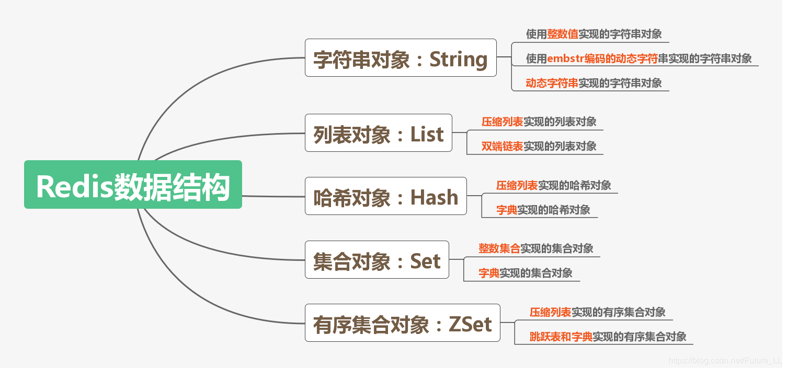
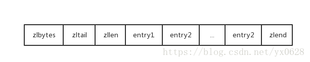

## 1. 索引
**参考文章：https://blog.csdn.net/Fmuma/article/details/80287924
https://blog.csdn.net/mine_song/article/details/63251546?depth_1-utm_source=distribute.pc_relevant.none-task&utm_source=distribute.pc_relevant.none-task**  

**还需进一步了解**  
#### 使用索引的优缺点
使用索引可以大大提高查询速度  
索引会降低表的更新速度，对表进行 insert，update，delete时，要同步更新表的索引  
索引会占用磁盘空间的索引文件    

#### 1. 普通索引
创建普通索引的一般语句是：
``` sql
CREATE INDEX indexName ON tableName(columnName(length));
或
ALTER tableName ADD INDEX indexName ON (columnName(length));
```
这两条语句都是在表tableName中为列columnName创建名为indexName的索引

#### 2. 唯一索引
与普通索引的区别是，唯一索引的值必须唯一，但允许有空值。 如果是组合索引，则组合必须唯一  
创建唯一索引的一般语句是：
``` sql
CREATE UNIQUE INDEX indexName ON tableName(columnName(length));
或
ALTER tableName ADD UNIQUE indexName ON (clolumnName(length));
```

#### 3. 主键索引
表的主键是一个特殊的索引,每个表中只能有一个主键，唯一且非空  
通过PRIMARY在创建表时指定主键
``` sql
CREATE TABLE tableName(
ID int not null,
userName varchar(20) not null,
PRIMARY KEY(ID));
```

#### 4. 组合索引
将多个列建立组合索引
``` sql
ALTER TABLE tableName ADD INDEX indexName ON (colName1, colName2, colName3);
```

**需要注意包含null值的列不会被包含在索引中**  
**每建立一个索引，该列的值就会被复制一份来生成索引**  

#### 5. 索引原理

索引是通过平衡树来实现高效的查找的  
包含索引的数据在内存中以平衡树来存储
聚集索引：在B+索引树叶子节点存储实际数据   
非聚集索引：数据不存储在叶子节点  
如果查找基于的是主键的值，那么直接使用聚集索引即可  
如果基于的不是主键值，那么会先通过索引来查找到主键值，然后再通过聚集索引来定位数据  

一般的数据查询，最终都是通过主键的聚集索引来查找，例外是
**覆盖索引**，覆盖索引中，索引列中已经包含查询列，在索引中已经可以找到需要的数据。

#### 6. B+树
**B+树相比B树的好处：**
- (主要原因)B+树的元素遍历效率更高，查询多条数据时，B树可能需要做局部的中序遍历，会有跨层访问，而B+树中的数据都在叶子节点，并且节点之间用链表相连，可以连续访问。
- B+树的磁盘IO效率更高，B+树内部节点中不存储数据指针信息，盘块中可以容纳的节点数更多，索引时的IO读写次数会减少
- B+树查询效率稳定，B树可能在非叶子节点结束搜索，而B+树总是要到叶子节点，所以查找的时间比较稳定。

#### 7. B*树
在B+树的基础上，B*树在非根节点和非叶子节点中增加了指向兄弟节点的指针，并且要求每个节点的关键字不少于2*M/3,要求块的利用率更高。  
B+树的分裂只影响当前节点和父节点，而B*树在节点满时会向兄弟节点转移，所以需要指向兄弟节点的指针。  
B*树的分裂概率更低，空间利用率更高。  

#### 8. MySQL数据库引擎Innodb和MyISAM在索引上的区别
- 它们都是采用B+树来做索引  
- MyISAM中B+树叶子节点存储指向数据行的指针，数据文件和索引文件是分开的  
- Innodb中B+树的叶子节点直接存储数据行，默认在主键上建立索引，其聚集索引的文件就是数据文件  
采用Innodb默认从主键创建索引，如果没有主键使用唯一键，如果没有唯一键则会生成一个自增列用于生成索引
而在MyISAM中的辅助索引跟主键创建的主索引没有区别  

#### 9. MySQL中模糊查询时的索引失效
MySQL中进行模糊查询时，如果%在前面，会发生索引失效。  
索引失效的原因是，范围首先要由第一个字符来确定，当前面是%时，无法建立。
**解决的方法：**  
将模糊语句反转，同时对应查询反转的列  
select * from Table where reverse(name) like reverse('%三')  

原理：比如在MySQL中name列查询“%abc”
name列中有数据“aabc”，“cabc”，“aaac”，生成name_reverse列，其中存储“cbaa”，“cbac”，“caaa”  
将模糊查询反转为“cba%”，对应语句select * from Table where name_reverse like "cba%"  
即可正确查询到“aabc”，“cabc”对应行，同时索引有效 

当索引的列包含查询列时，即覆盖索引时，也会走索引，但这并不是索引查找。知识因为当前需要的列就在索引中，扫描索引查找数据即可。

## 2. 一条SQL语句耗时长的原因
**参考文章:  黄小斜微信公众号  
https://mp.weixin.qq.com/s?__biz=MzUyOTk5NDQwOA==&mid=2247487500&idx=2&sn=3a0eb0bc9222236daddfabd772e2f687&
chksm=fa59d7cbcd2e5edd9c6a89f88a82beecd108817c6ac3a84d58eeaa076d982ac950c7f546f5fb&scene=27#wechat_redirect**

分两种情况讨论  
1. 大部分时间都正常，偶尔很慢
2. 大部分时间都很慢
#### 1. 偶尔很慢  
1) 有可能是数据库在刷新脏页，数据库中的事务执行数据修改后，不会直接从内存刷新到磁盘中，而是先储存到redo log文件中，等到合适的时机，在根据redo log中的记录将数据写到磁盘中  
当文件在一次更新操作后满了，那么不得不根据redo log中的内容，将数据写到磁盘中，此时其他操作可能会暂停，导致sql语句的执行变慢  
2) 所访问的数据被其他线程占用，对数据加了锁，不得不等待所得释放
#### 2. 大部分时间都很慢
这种情况一般是没有发挥索引查询的优势  
1) 没有定义索引  
2) 定义了索引，但没有被使用，比如在“=”左端存在表达式
``` sql
select * from tableName where id+1=1000;
```
此时左边进行了运算，索引即使定义了，却没能被使用， 应该写为
``` sql
select * from tableName where id=1000-1;
```
3) 函数操作也会导致索引不会被使用
4) 数据库选错索引  
``` sql
select * from t where 100 < c and c < 100000;
```
即使定义了索引，数据库仍然可能会扫描全表来查找数据，因为通过索引查找需要先对应到主键，然后通过聚集索引查找，那么需要两次索引操作，如果c的条件选中了大部分数据，那直接扫描全表反而快些。  
数据库如果预测扫描的行数很多，那么就会选择扫描全表，而不走c的索引  
数据库预测的方法：   
通过采样索引列数据的不同值个数来形容列的区分度，列的值越互不相同，越不容易重复，区分度越高，意味着100 < c and c < 100000可能包含的行越少，就更倾向于使用索引  
但是由于使用的是采样的方法，统计上的数据可能刚好c的区分度比实际低，造成c的索引没能使用，而是全部扫描。

## 3. 数据库使用自增主键和UUID的优缺点
**参考文章: [enter description here](https://www.jianshu.com/p/f5d87ceac754)**
#### 1. 自增主键
自增ID时，我们无需对数据指定id，数据库会自动将前一行id值加1作为改行的id值  
**优点**  
速度快，按顺序存放，索引建立方便，检索快  
数字型，占用空间小，易排序  
**简单的说就是性能更好**  
**缺点**  
插入指定id时不方便，不能跟已有值重复，且需要大于最大id  
表的合并很可能会出现主键重复问题  
拆分表时需要重新设定自增的值  
**主要问题是表的合并和拆分不方便**  

#### 2. UUID
UUID含义是通用唯一识别码 (Universally Unique Identifier)， 指在一台机器上生成的数字，它保证对在同一时空中的所有机器都是唯一的。 通常平台会提供生成的API。 换句话说能够在一定的范围内保证主键id的唯一性。  
**优点**  
表的拆分合并过程，可以保证主键的全局唯一  
大量数据时不会像int那样越界
**缺点**  
会产生表碎片，磁盘使用率低  
插入和查询速度慢  
UUID占用空间大，建的索引越多越严重  

## 4. 数据库事务ACID
**参考文章: https://blog.csdn.net/dream_188810/article/details/78870520  
https://blog.csdn.net/l1394049664/article/details/81814090**  

ACID代表事务的基本属性，即原子性(Atomicity)，一致性(Consistency)，隔离性(Isolation)和持久性(Durability)。
#### 1. 原子性
事务的所有操作要么全部执行，要么都不执行。这使得在中间过程中如果操作失败，则进行回滚，所有操作都取消。
#### 2. 一致性
在事务执行前后，数据库从一个一致状态转换到另外一个一致状态。不会出现中间的状态。  
这表示数据库的一些约束在事务执行前后始终满足，不如A和B总财产5000元，事务执行时A和B进行了交易，但总钱数5000不会改变。
#### 3. 隔离性
一个事务所做的修改在提交之前对其他事务是不可见的。多个事务的操作不会互相干扰。  
#### 4. 持久性
一个事务一旦被提交了，其结果就会被永久保存到数据库中。

#### ACID实现原理
- 原子性实现原理： undo log 
用于实现回滚操作，还可以实现多版本并发控制MVCC
undo log实现数据的备份，在事务执行错误时或者用户执行了rollback语句，系统根据undo log将数据恢复到事务执行之前的状态  
**注意：**undo log是逻辑日志，针对某一行记录的修改  

redo 记录整个页的数据修改  
binlog  

- 持久性实现原理： redo log  
redo log是新数据的备份，在事务提交之前，只要将redo log持久化即可，不需要将数据持久化  

- 隔离性实现原理： 锁  
四种隔离级别，读未提交，读已提交（大部分数据库默认），可重复读（MySQL默认），串行化  
两类锁：  
共享锁（读锁）
排他锁，MYISAM中叫独占锁（写锁）
一致性锁定读 select。。。for update(排他锁)，select。。。lock in share mode(共享锁)，一致性非锁定读（默认）  


## 事务隔离级别
**参考文章:https://blog.csdn.net/l1394049664/article/details/81814090  
https://blog.csdn.net/qq_34569497/article/details/79064208  
https://www.php.cn/sql/422419.html**  

数据库一般只有读数据和写数据两种操作，如果不存在任何隔离，那么在多个线程并发操作数据库时，可能会出现以下错误：
1) 多个事务同时修改同一条数据，这会造成数据的错乱，丢失。  
2) 一个事务更新一条数据时，另一个事务读取了还未提交的数据(可能提交也可能回滚)，这时对未提交的数据产生了依赖关系。这种现象称为脏读。  
3) 一个事务先后读取一条数据时间间隔中，另一个事务修改了这条数据并提交，这时候出现两次读取的数据不一致，称为不可重复读。  
4) 一个事务A操作时，找到数据id位置准备插入，另一个事务插入了一条数据，导致A在插入时对应id已经有数据，插入失败。查询时没数据，插入却失败了，像幻觉一样，叫幻读  
以上四个问题的来源分别为:  
1) 修改时允许修改  
2) 修改时允许读取  
3) 读取时允许修改  
4) 读取时允许插入  
不可重复读和脏读的区别是: 不可重复读是读取了其他事务提交的数据，脏读是读取了其他事务未提交的修改数据。  
幻读和不可重复读的区别是: 它们都是读取了已提交的数据，但不可重复读是其他事务修改了数据，幻读是其他事务插入了数据。
不可重复读针对同一个部分数据，幻读是针对数据的量(如数据条数)  
不可重复读是由update引起的，幻读是由insert引起的  

事务有四个隔离级别  
#### 1. Read uncommitted 读未提交
所有事务都可以看到其他事务未提交的执行结果，各事务之间几乎完全透明。可能会产生脏读  
一个事务在写时，不允许其他事务写，但允许读  
#### 2. Read committed 读已提交
其他事务只能读取一个事务已提交的内容。是大多是数据库默认的隔离级别(mysql默认为可重复读)。这是满足事务隔离性最基本的要求。这种隔离级别下也可能会出现不可重复读。  
未提交的写事务禁止其他事务访问该行，读事务允许其他事务访问。可以通过"瞬时共享读锁"和"排他写锁"实现
#### 3. Repeatable Read 可重复读
mysql默认的隔离级别，它确保一个事务的多次读取都能看到相同的数据。实现方式是当一个事务操作涉及到一部分数据时，其他事务不能同时对这部分数据进行修改。可重复读的隔离级别无法避免幻读，因为其他事务的插入操作没有被限制。 
读事务执行时禁止写事务，可以通过"共享读锁"和"排它写锁"来实现。
#### 4. Serializable 串行化
可串行化是最高的隔离级别，同时代价很高，性能较低。同时避免了以上所有事务并发时的错误。
它采用锁表(而非行级锁)的方式实现，效率极低。在读时加上共享锁，写时加上排它锁。

**在这四个隔离级别下，update，insert和delete这些更新操作都会加排他锁，范围查找时都会采用间隙锁  
而select操作，在read uncommited是不加锁，在read conmitted和repeatable read中会采用一致性读，在serializable中采用共享锁**
**具体的锁情况参考[Innodb锁](https://blog.csdn.net/keda8997110/article/details/45080453)**

## 5. 数据库中的锁
**参考文章: https://blog.csdn.net/dream_188810/article/details/78870520**  

功能上，有共享锁和排他锁，分别对应读锁和写锁。  
粒度上，有行级锁和表级锁，分别实现对特定行和整个表加锁  
mysql中大多数事务都不只是简单的行级锁，基于性能的考虑，他们一般在行级锁基础上实现了多版本并发控制(MVCC)，这一方案也被Oracle等主流的关系数据库采用。它是通过保存数据中某个时间点的快照来实现的，这样就保证了每个事务看到的数据都是一致的。详细的实现原理可以参考《高性能MySQL》第三版。  

**Innodb中的锁：**  
**参考文章：https://blog.csdn.net/keda8997110/article/details/45080453**  
- 共享锁，读锁，允许多个读，阻止其他事务获取相同数据集的排他锁
- 排他锁，写锁，允许获得排他锁的事务更新数据，阻止其他事务获取相同数据集的排他锁和共享锁
Innodb允许行锁，对数据行加锁是通过给索引中的索引行加锁实现的，也就是只有通过索引检索数据，才能加行锁，否则就只能加表锁  
对于update，insert，delete语句，Innodb会自动给涉及的数据集加排他锁，而select语句默认是不加锁的，我们可以通过在末尾添加lock in share mode或for update给涉及的数据集加共享锁和排他锁  
**在行锁中，是针对索引加的锁，不是针对记录**，所以当使用相同的索引值进行检索，即使访问不同的数据行，也会被阻塞，比如
``` 
假如表table中是针对id列建立了索引，当我们查询同一个id的行加锁后，其他相同id的加锁都需要等待
table表中数据(id, name),(1,'aa'),(1,'bb')
select * where id=1 and name='aa' for update 
在另一个session中执行
select * where id=1 and name='bb' for update   // 这条语句会等待
```
**除了行锁和表锁之外，Innodb中还有间隙锁**  
当通过范围查找并且加锁时，范围内存在的行会别加锁，同时范围内不存在的行也会加锁，这些行的插入也需要等待  
间隙锁可以防止幻读，在访问的范围内不允许插入  
除了在范围访问会加间隙锁，在通过相同条件访问不存在的行时，也会加间隙锁  


## MySQL数据量过大，可以如何处理
对数据库进行分片，解决单台数据库的压力，分片可以使用MyCat来实现

## 数据库分片方式
- 纵向切分
根据不同的表进行切分，将不同的表切分到不同的数据库中  
数据库表结构不同
- 横向切分
根据表中数据的逻辑关系进行切分，将表中的数据切分到不同的机器  
数据库表结构相同，但数据不同

## MySQL锁
Innodb 共享锁 排他锁
MyISAM 独占锁
自增锁

MySQL日志分几类
binlog 慢查询日志 
Innodb redo undo
MVCC多版本并发控制


MySQL架构体系，分三层
引擎区别，事务，锁

事务实现原理， undo log， redo log， 锁

Innodb支持自适应hash，可以自动的转化为hash表

有主键根据主键创建索引，没有主键使用唯一键，没有唯一键的话生成6字节的row_id作为主键，生成索引
**如果主键不是自增，索引树的插入会出现更多地节点分裂，所以推荐主键自增**

**在事物的四个特点中，一致性是根本追求**
一致性实现原理：

数据库中内存和磁盘的数据交互是以页为单位的，一页默认4k，读取一个页原因时间局部性，空间局部性（局部性原理）
Innodb 一页16k

索引面试问题
索引数据结构
 
索引分类
    **主键索引**
    **辅助索引**，也叫普通索引，在非主键列上建立的索引，辅助索引叶子节点中放得回事实际数据行记录，而是主键值，需要**回表**，在主键索引上查找数据，，在查询辅助索引时，如果叶子节点中保存的刚好是要查询的字段数据，那么此时叫做**索引覆盖**，数据库中有标识using index
    **唯一索引**，列值唯一，可为空，主键唯一且非空
    **全文索引**，
    **组合索引**，多个列共同组成的索引
    
    组合索引（name，age）
    最左匹配原则，
    select * from table where name=? and age=? 走索引
    select * from table where name=? 走索引
    select * from table where age=?  不走索引，索引中不能跨过name来查找age，就像不能略过省来查找县
    select * from table where age=? and name=? 走索引
    
    
    索引下推：
    组合索引（name，age）
    select * from table where name=? and age=?
5.6之前
    先根据name把所有数据查询回来，然后在server层进行age字段的数据筛选
5.6及以后版本
    从存储引擎来去数据时，会根据name，age两个字段做筛选，将符合条件的来去回来
    
组合索引key是怎么存储的
1,1
1,2
1,3
2,1
2,4
3,2
  （1,2          2,4）
（1,1  1,3） （ 2,1  3,2）
    先以第一列为准，当第一列相等时，再比较第二列
    
    谓词索引：
    select t1.name,t2.name from t1 join t2 on t1.id = t2.id;
    计算向数据移动
    
索引的技术名词
 回表
 覆盖索引
 最左匹配
 索引下推
 
MySQL优化
explain select * from table
性能监控 set profiling=1； show profile all for query 1；

设计表时的优化，数据类型，主键选择
执行计划
索引优化，索引使用，不要在索引查询中使用表达式

MySQL
主从复制  binlog  模式：一主多从，多主多从
读写分离，主从复制下，实现数据一致，**会有复制延迟   MTS并行复制** 
分库分表

# Redis

## Redis支持的数据类型
Redis是数据是以key-value形式来存储的  
String set hash list zset(有序列表)

## Redis单线程
redis工作在单进程单线程下，redis会把并发访问通过队列串行化  

Redis是基于内存操作的，其性能瓶颈是CPU，在这种情况下，单线程不会有cpu在线程上下文切换和锁上的开销  
但单线程可能无法发挥多核CPU的性能，在这种情况下，可以打开多个redis来解决

## Redis的持久化方案
- AOF 日志模式
以日志的形式记录数据库数据操作，记录数据比较齐全，数据库内容的增加和修改都会被记录，容易产生脏数据，造成日志文件很大
- RDB 快照模式  （redis默认的持久化机制）
间隔一段时间备份一次数据库，但间隔时间一般较长，期间一旦程序崩溃，可能丢失数据

## redis和memcache的区别
**参考文章：https://www.jianshu.com/p/30831f9a0fac
https://blog.csdn.net/lhx574938077/article/details/81838819**
- redis支持数据的持久化，合理的配置下，redis数据不容易丢失，而memcache不支持数据的持久化，**更适合作为只读数据的缓存**
- redis和memcache都是基于key-value结构来存储数据的，但memcache中value的数值类型只能试String，redis中除String外还有list，hash，set，zset数据类型，可以存储内容更丰富
- memcache在并发场景下可以通过cas保证并发修改的安全，redis是单线程，事务支持比较弱
- memcache扩展性稍差，不想redis可以方便的集群，实现主从
- 当物理内存用尽后，redis可以将冷数据存储到磁盘中，也就是实际使用内存可能大于物理内存，memcache不支持


## Redis删除机制和内存淘汰
**参考文章：https://www.cnblogs.com/zhaoyunlong/p/9893201.html**  
redis采用定期删除+惰性删除策略  
- 定期删除：redis每隔100ms会检查删除一次过期数据，不过不是全部检查，而是随机抽取部分设置了过期时间的数据进行检查，过期删除。  
- 惰性删除：在访问key时，检查是否过期，过期则删除，访问失败

所以redis中有数据未被检查到，同时又长时间没被访问时，会存在过期而没删除数据

当redis缓存已满时会进行内存淘汰，淘汰策略在redis设置文件中可设定
- noeviction，内存不足，新写入数据报错
- allkeys-lru，在空间中移除最近最少使用的key   **推荐使用**
- allkeys-random，在键空间中随机删除数据   
- volatile-lru， 在设定了过期时间的key中，删除最近最少使用的key
- volatile-random，在设定了过期时间的key中，随机删除key
- volatile-ttl，在设定了过期时间的key中，有限删除有最早过期时间的key

## redis主从模式
针对数据库单点故障的问题，如果只有一个数据库，当发生故障使会造成数据丢失
redis主从机制下，主库通过复制功能将数据备份到从数据库，主库的写入也会同步到从数据库，而数据读取是在从数据库中，**实现了读写分离**
当master故障时，会从slave node中选择一个slave切换为master


## Redis做缓存使用中的一些问题
**参考文章：https://blog.csdn.net/zeb_perfect/article/details/54135506?depth_1-utm_source=distribute.pc_relevant.none-task&utm_source=distribute.pc_relevant.none-task 
https://blog.csdn.net/qq_36236890/article/details/83964399**  

#### 缓存穿透
请求不存在的数据，此时缓存中不存在会到数据库查询，造成数据库压力过大。
**解决方案：**
- 缓存空数据，当请求缓存中不存在的数据时，把在数据库中查询也为空的key存储在redis中，值为null。这类值应该设定一个较短的过期时间，大量的类似数据浪费缓存空间
- 布隆过滤器 bloomfilter
过滤器位于缓存之前，其中可以通过hash set存储了存储数据库中存在的数据，如果在bloomfilter中查询不存在，则直接返回查询失败，不需要到缓存或数据库中查询。
**对于一些恶意攻击，往往随机产生查询数据，这种情况下因为几乎没有重复的数据查询，所以加锁或者缓存都无效。这种情况下采用bloomfilter可以达到比较好的效果**

#### 缓存雪崩
缓存宕机或者大量数据同时过期，导致大量的请求都落在数据库上，造成数据库的连接异常  
**解决方案：**  
- 实现缓存集群，保证高可用
- 加锁，访问不存在的数据时加锁，然后去数据库中访问，然后更新数据到缓存，使其他该数据访问等待
- 在设置过期时间时，在原有时间上叠加一个随机的时间，使数据的失效时间错开

#### 缓存击穿
当数据中存在**热点数据**，这些数据会被高并发的访问，若这种数据过期，在从数据库中更新数据到缓存之前，大量的请求对数据库进行访问，造成数据库压力过大  
**解决方案：**
- 当访问数据在缓存中不存在时，通过key进行加锁，进入数据库查询，其他的查询都进行阻塞等待或者返回失败。在分布式场景下要使用分布式锁。这种方法降低了吞吐量
- 在缓存的value中加入过期时间，在访问时发现快要过期，提前进行刷新。

#### 缓存数据一致性问题
redis缓存无法保证数据的强一致性，要求数据强一致性的场合不能使用缓存    
读数据时，先从缓存读取，如果缓存中不存在，到数据库中读取，然后返回结果，读到的数据更新到缓存中   
写数据时，先将数据写入到数据库中，然后删除缓存或更新缓存，为了保证删除成功，可以采用消息队列  
**解决方案：**
- 分布式锁。读数据时，如果缓存中没有，先进行加锁，然后去数据库读取，更新缓存。写数据时可以根据数据唯一Id先加锁，删除缓存，然后更新数据库，缓存可更新也可不更新。写数据时需要保证公平锁可以采用zookeeper实现的分布式锁。


#### 缓存并发
多个redis的client同时set key时引发的并发问题  
**解决方案：**
- 分布式锁，当进行数据操作时，对当前数据加锁，使其他的客户端重试
- 串行化，维护一个队列，使其中的任务串行执行

redis集群不支持事务

**学习文章：https://blog.csdn.net/qq_34337272/article/details/80012284?depth_1-utm_source=distribute.pc_relevant.none-task&utm_source=distribute.pc_relevant.none-task**  

## redis事务
redis事务的功能相对弱，通过multi开启事务，通过exec执行事务，中间的命令将入放入队列，在exec后一起执行，事务不会被打断  
但是redis事务中在语句语法错误是会放弃执行，在语句有异常时不会回滚，如**incr name**，name是一个字符串，无法自增，在执行到该语句时事务会报错，但是其他(前后语句都会执行)的语句会执行且不会回滚

**redis事务实现乐观锁**  
乐观锁一般通过cas来实现，在redis中通过watch可以方便的实现  
首先watch一个数据，在事务执行exec之前如果watch的数据被修改，那么事务中的值将无法被修改  

``` redis
1.set age 20
2.watch age
3.multi
4.get age
5.set age 50
6.exec
7.get age
```
如果在语句2执行之后，语句6执行之前，age被修改，那么事务中age的set操作将会失败  
**watch必须在事务之前调用，在multi语句后不被允许使用watch**


## redis实现原理
redis是通过c语言编写的

**参考文章：https://www.cnblogs.com/songrang/p/10536128.html**



#### Redis中使用的数据结构
**1. SDS**  
Redis中字符串不是由c语言中的字符串实现的，而是自己构建的SDS（Simple Dynamic String）它的定义为
``` java
struct sdshdr{
     //记录buf数组中已使用字节的数量，等于 SDS 保存字符串的长度
     int len;
     //记录 buf 数组中未使用字节的数量
     int free;
     //字节数组，用于保存字符串
     char buf[];
}
```
- 相对于c语言中的字符串，这种结构可以在**常数时间获取字符串长度**  
- SDS不以空字符作为结束标志，可以存储二进制数据，不像c语言中字符串会在空字符处停止
**空间预分配：** 数组长度不够时，会进行动态扩展，保证空间大于所需空间  
**惰性空间释放：** 字符串缩短时，不立即释放空间，避免字符增加时扩展的开销

**2. 链表**  
双端链表  
无环，表头的pre和表尾的next指向null  
带有长度计数  

**3. 字典**  
通过hash表实现  
拉链法，数组+链表  
键值对中value可以是指针，uint64或int64  
触发扩容的条件：没有执行BGSAVE或者BGREWRITEAOF命令，并且负载因子大于等于1  
正在执行BGSAVE或者BGREWRITEAOF命令，并且负载因子大于等于5  
负载因子=表中存在的数据量/表中数组容量  
**渐进hash：** 在扩容时，如果数据量较小，可以直接进行rehash操作。当其中有大量数据时，暂停访问扩容将造成长时间的停顿，这时会将访问和rehash同时进行，其实现是，在旧表中访问的数据都顺便移动到新表中去，直到旧表为空  
在旧表中找不到时变去新表中找，增加数据存到新表中   
触发收缩的条件：负载因子小于0.1时触发收缩  

**4. 跳跃表**  
**参考文章：https://www.sohu.com/a/293236470_298038**
跳跃表是一种链式的有序数据结构，并且节点分为多层，在普通的有序链表基础上，给节点增加了层数  
在这中结构下，允许在查找元素时一次**跳跃多个节点**  
其插入和删除操作的时间复杂度大约为O(nlogn)  
- 跳跃表每一层都是有序的链表
- 跳跃表分为多层，每层链表至少有head和tail两个节点
- 最底层链表包含所有元素
- 每个节点都包含两个指针，一个指向同层的下一个节点，一个指向下层的（相同）数据
- 跳跃表插入节点是，通过抛硬币确定层数，当是正面时层数加一，直到出现反面，其原理是跳跃表高层数据时底层数据1/2时性能更好，而出现硬币正面的概率是1/2，每出现一个正面表示可多加一层 ，这是概率上的。
- 删除节点时，直接删除对应节点即可

**为什么redis中不使用红黑树实现有序集合：**  
- 红黑树实现范围查找时，需要中序遍历树，如果不对树的进行调整，实现相对复杂，而在跳跃表中，只要找到最小节点，沿链表进行遍历即可  
- 红黑树中需要动态调整树的结构，插入和删除操作更加的复杂，在跳跃表中，直接决定层数，插入即可。
- 跳跃表实现简单

**参考文章：https://blog.csdn.net/u010412301/article/details/64923131** 其中引用了原作者的看法
- 跳跃表通过修改层数增加的概率，可以调整每个节点平均需要的指针树，可以使他少于平衡树，空间利用率更高
- 跳跃表的范围查找更方便，不会比平衡树差  
- 跳跃表实现简单，方便实现，调试  

**5. 整数集合**  
整数集合intset用于存储整数值，其中可以保存int16 int32 int64类型整数，其中没有重复值  
整数集合的元素保存在数组中，元素按顺序放置  
**升级：**当新插入的数据长度大于当前数据长度时，会进行升级
- 根据新元素类型，新建一个更大数据长度的数组
- 将旧数组中元素升级为更大的数据长度，放入新数组，保持有序
- 插入新元素，回收旧数组空间
升级过程是为了保证空间不被浪费，没有**降级策略**  

**6. 压缩列表**
压缩列表ziplist，压缩列表是为了节省内存而实现的，它并不是一种压缩算法，而是通过对数据编码放到连续的内存中

压缩列表中主要内容是节点，其中保存字节数组或者整数


#### Redis五大基本类型实现
**参考文章：https://www.cnblogs.com/ysocean/p/9102811.html
https://blog.csdn.net/Future_LL/article/details/88525004**  

Redis中支持string，list，set，zset，hash物种数据类型，其中键和值都属于RedisObject对象，其中标明了其数据类型等信息，结构为  
``` java
typedef struct redisObject{
     unsigned type:4;  //类型
     unsigned encoding:4;     //编码
     void *ptr;      //指向底层数据结构的指针
     int refcount;     //引用计数
     unsigned lru:22;     //记录最后一次被程序访问的时间
 
}robj
```
type指明对象属于string，list，set等哪种数据类型  
**redis中的键都是String类型**
redis中每种数据类型都由至少两种数据结构实现

**1. String**  
- int，整数值实现，保存可以用long类型存储的整数值
- embstr，使用embstr编码的SDS实现，保存长度小于44字节的字符串
embstr保存到字符串，RedisObject对象和SDS对象一起分配，访问更方便，但扩容时需要两个对象一起新建
- raw，SDS实现，保存长度大于44字节的字符串
原始的SDS，RedisObject和SDS对象分开创建  
**redis浮点数作为字符串保存，在使用时转化为浮点数**  

**2. List**  
简单的字符串列表，按照插入顺序排序
- ziplist，压缩列表实现
当同时满足两个条件时使用，1. 元素个数小于512个 2.所有元素长度小于64字节
- linkedList，链表实现，不满足上面两个条件时使用

**3. hash**  
- ziplist，压缩列表实现
当同时满足两个条件时使用，1. 元素个数小于512个 2.所有元素长度小于64字节
- hashTable，hashMap实现，不满足上面两个条件时使用

**4. Set**  
无序列表
- intset，整数集合
当同时满足两个条件时使用，1.元素个数小于512  2.所有元素都是整数
- hashTable，hashMap实现，set中值存储在哈希表的key中，value为null，与java中HashSet相似
不满足上面两个条件时使用

**5. Zset**  
有序列表
- ziplist，压缩列表实现，元素按照分值由小到达排列，一个节点保存元素值，一个节点保存元素分值
当同时满足两个条件时使用，1. 元素个数小于**128**个 2.所有元素长度小于64字节
- skiplist，跳跃表实现，Zset结构中包含**一个字典和一个跳跃表**，字典的键值对分别是元素值和元素分值，跳跃表中保存有序的集合
不满足上面两个条件时使用  
在跳跃表实现中，字典和跳跃表通过指针共享元素，元素不会重复。同时使用字典和跳跃表，是为了在**单值查找**时通过字典实现O(1)复杂度，其他范围查找和排序工作交给跳跃表，**总之这里是通过牺牲空间来享受字典O(1)复杂度的查找便利**  


## 数据库高并发解决方案
**参考文章：https://blog.csdn.net/qq_36236890/article/details/82390412 
https://segmentfault.com/a/1190000017018855**  

- 页面静态化，静态化页面可以不通过Tomcat直接返回
- 增加redis缓存
- 批量读取，把多个请求的查询操作合并到一起进行，减少数据库访问次数
- 建立索引，加快查找速度，但建立索引同时会给数据库的插入带来额外的开销，插入时需要建立索引，所以索引最好用于大量查询而变动小的表
- MySQL主从读写分离。分为主服务器和从服务器，主服务器负责写，同时更新的数据同步到从数据库，从数据库负责读请求。
- 分库分表
- 集群，将请求分发到不同的数据库上
- 分布式，将同一个请求分发到不同的机器上执行，适用比较复杂的业务逻辑

CDN，域名层面分流，将请求分发到距离用户较近的服务器上

#### MySQL读写分离的问题
MySQL读写分离会带来不一致问题，主库的数据改变会记录到日志文件**BINLOG**中，该文件传输到从数据库中，总数据库在进行执行，使数据与主库一致。slave数据库会开启一个IO Thread用于读取binlog文件写入relaylog，然后利用relaylog中重建数据  

#### 分库分表的方式
**参考文章：https://blog.csdn.net/azhuyangjun/article/details/86976514**
数据库切分方式分为垂直切分和水平切分
- 垂直切分
**垂直分库:** 根据业务逻辑将关联不大的表分到不同的库中，类似于微服务的治理，把不同业务逻辑涉及的表划分到不同的库中  
**垂直分表:** 对于列数较多的表，把访问频繁的列或数据量较大的列分为不同的表  
数据库表结构不同  
垂直划分根据业务逻辑把数据也进行解耦，业务清晰，可以提高并发量。  
但垂直划分在涉及跨库查询时，无法join，划分后仍然可能单表行数过多，数据量过大。  

- 水平切分
数据库行数过大，单表操作性能较差，垂直划分仍然无法解决问题，可以采用水平切分   
**库内分表：** 将单表数据进行划分，将表中数据行分到库内不同的表中  
库内分表无法缓解MySQL数据库压力，在一定程度上可以加快查询速度
**分库分表：** 根据数据的关系，将表中的数据行划分到不同的数据库中

数据库表结构相同，但数据不同  
水平划分可以解决单表数据过大的问题，提高系统的负载能力  
但涉及扩库的数据操作时复杂度增加

水平切分的划分方法，可以根据主键id的范围或hash值分库  
根据范围的划分，实现简单，扩展方便，但是会存在负载不均匀，一般新数据的访问量较大  
根据hash值或者取模划分，不同库的负载均匀，但是扩展不方便，需要rehash

**分库分表后怎么联合查找：**  
- 分步查询，先查询主表得到关联表的ID,再去关联表中查找
- 联合查询，同时向多个库发起查找请求，再汇总数据

**分库分表后的主键ID：**
防止ID的碰撞，需要基于全局来生成ID，
- 利用redis的incr来生成ID，缓存的读取速度快
- 使用UUID，保证全球唯一，不会出现ID碰撞。但不保证自增，且UUID字符串过长，查询效率低
- snowflake算法，可以在分布式下生成ID，按时间自增排序  
生成Long类型的ID，根据时间戳和机器码，序列号等

**实现分库分表的工具：**
- cobar 阿里巴巴 
- atlas 360开源
- mycat 基于cobar