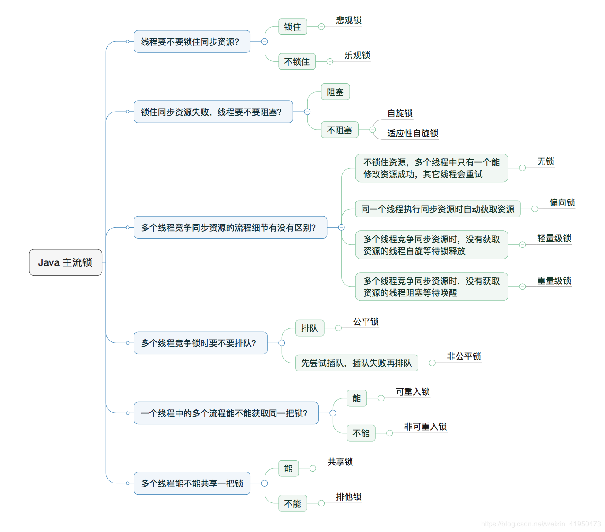

## Java 锁分类

**轻量锁：** 多个线程竞争资源时，未获取到资源的线程自旋等待锁释放    
**重量锁：** 多个线程竞争资源时，未获取到资源的线程阻塞等待被唤醒  

**悲观锁：** 操作前加锁，synchronized和Lock接口实现类都是悲观锁  
**乐观锁：** 访问不加锁，一般通过CAS来实现。在更新值前检查是否被修改，没有被修改则直接更新，如果被修改则重新计算并重试，java.util.concurrent.atomic中的原子类是通过CAS来实现的。
**优缺点：**
悲观锁有锁开销，乐观锁自旋操作占用cpu资源，ABA问题(可通过加入版本来解决)

**自旋锁：**
**非自旋锁：**
**优缺点：**
**自旋锁避免了cpu进行状态切换，但占用了cpu的处理时间**，阻塞或唤醒一个 Java 线程需要操作系统切换 CPU 状态来完成，这种状态转换需要耗费处理器时间。如果同步代码块中的内容过于简单，状态转换消耗的时间有可能比用户代码执行的时间还要长。所以自旋锁就可以避免 CPU 切换带来的性能、时间等影响。
**适应性自旋锁：**自旋的时间不再固定，而是由前一次在一个同一个锁上的自旋时间和锁对象来决定。

**偏向锁：** 偏向锁是指一个资源一直被一个线程访问，那么该线程会自动获取锁，减少获取锁的开销  
一些情况下，锁总是被一个线程获得，为了减少多次获取锁的开销，设计了偏向锁