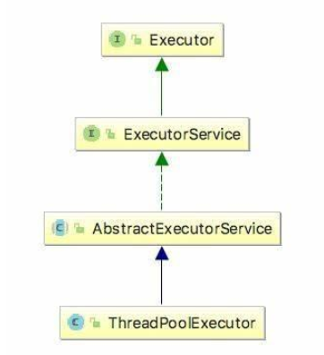

**参考文章：
https://blog.csdn.net/weixin_41950473/article/details/92080488
https://www.jianshu.com/p/1c3ef2768528
http://blog.sina.com.cn/s/blog_c038e9930102v2ht.html**

## Java 锁分类


**轻量锁：** 多个线程竞争资源时，未获取到资源的线程自旋等待锁释放    
**重量锁：** 多个线程竞争资源时，未获取到资源的线程阻塞等待被唤醒  

**悲观锁：** 操作前加锁，synchronized和Lock接口实现类都是悲观锁  
**乐观锁：** 访问不加锁，一般通过CAS来实现。在更新值前检查是否被修改，没有被修改则直接更新，如果被修改则重新计算并重试，java.util.concurrent.atomic中的原子类是通过CAS来实现的。
**优缺点：**
悲观锁有锁开销，乐观锁自旋操作占用cpu资源，ABA问题(可通过加入版本来解决)

**自旋锁：**  
**非自旋锁：**  
**优缺点：**
**自旋锁避免了cpu进行状态切换，但占用了cpu的处理时间**，阻塞或唤醒一个 Java 线程需要操作系统切换 CPU 状态来完成，这种状态转换需要耗费处理器时间。如果同步代码块中的内容过于简单，状态转换消耗的时间有可能比用户代码执行的时间还要长。所以自旋锁就可以避免 CPU 切换带来的性能、时间等影响。  
**适应性自旋锁：**自旋的时间不再固定，而是由前一次在一个同一个锁上的自旋时间和锁对象来决定。

**偏向锁：** 偏向锁是指一个资源一直被一个线程访问，那么该线程会自动获取锁，减少获取锁的开销  
一些情况下，锁总是被一个线程获得，为了减少多次获取锁的开销，设计了偏向锁  
偏向锁的获取过程：
当一个线程访问同步块时，如果其对象允许偏向锁  
检查对象MarkWord中的线程ID是否是当前线程，如果是则直接访问代码块
如果不是，那么当前线程需要通过CAS来获取锁，获取成功后，MarkWord中的线程ID修改为当前线程
如果获取失败，那么说明当前锁存在竞争，那么将在到达全局安全点时升级为轻量锁。

**公平锁：** 在拥有锁的线程释放锁时，优先让等待时间长的线程获取锁，也就是有排队先到先得
**不公平锁：** 加锁时先直接竞争锁，竞争不到再进行排队  
**优缺点：** 
公平锁的吞吐量相对非公平锁较低，因为它在分配锁时要唤醒等待的线程，在不公平锁中，如果刚好有线程请求锁，可以直接获取，减少了唤醒等待线程的时间。
线程持有锁的时间比较长时可以使用公平锁，这样对吞吐凉的影响并不大  
synchronized是不公平锁，Lock可以选择是公平锁或者不公平锁

**可重入锁：** 可重入锁又称递归锁，是指一个线程在外层获得锁后，在内层依然可以重复使用锁，前提是它们是同一个对象或类的锁。  
**不可重入锁：** 线程获得一个同步方法的锁之后，在访问锁对象下的方法，仍然需要获取锁  
不可重入锁容易发生阻塞  
可重入锁内部有一个加锁计数器，每进入锁Lock一次，计数器加1，unlock一次，计数器减1，当计数器归零时，锁被释放

**排他锁：** 锁一次只能被一个线程持有。典型的是写操作的锁，在进行写操作时，其他线程不同同时对资源进行读或写。  
**共享锁：** 锁可以同时被多个线程持有。典型的是读操作的锁，对资源的读操作可以多个线程同时进行，但不允许同时有写操作。 

**可中断锁：** 线程在获取锁的过程中可以中断，Lock接口下的锁是可以中断的，synchronized是不可中断锁

**CAS缺点：** 
- ABA 
- 循环重试浪费cpu资源 
- 一次只能对一个共享变量进行操作

## synchronized
**加锁方式：**如果是对非静态方法同步，作用对象为方法所在对象  
如果是对静态方法同步，作用对象是类的Class对象  
如果是对语句块同步，需要指定作用对象  

**实现原理：** JVM是基于Monitor对象来实现同步的
在同步块前后加入monitorenter和monitorexit指令

synchronized锁信息存在Java对象头的MarkWord中

Java 1.6中，对synchronized做了优化，加入了自旋，偏向锁，锁消除，锁粗化和轻量锁等，使synchronized的性能有了很大提升。  
在Java1.6中，锁共有4种状态，无锁，偏向锁，轻量锁和重量锁  
**锁的升级：**
synchronized默认开启偏向锁  
在同步代码块被访问获取到锁时，锁对象的对象头的MarkWord和栈帧锁记录中会记录线程ID，之后线程的访问只需测试MarkWord中的线程ID，测试成功，则当前线程可以直接访问，测试失败，线程查看锁对象是否是偏向锁状态，如果不是则竞争锁，如果是则通过CAS将MarkWord中的线程ID设成当前线程，触发偏向锁的撤销。
在程序到达全局安全点时，检查锁对象的对象头中指向的线程是否存活，如果线程不存活，变为无锁状态，
如果线程存活，检查线程是否仍要竞争锁，如果是，锁升级为轻量级锁。  
也就是在这个过程中，如果有线程竞争，则升级为轻量级锁。

轻量级锁，在线程获得锁后，会将对象头中的MarkWord复制到栈中的锁记录（Lock Record）中，并将MarkWord中的轻量锁指针指向锁记录。  
其他线程在访问时会进行自旋等待，如果自旋获取失败，会将锁对象修改为重量锁  
线程在释放锁时，通过CAS将栈中的锁记录更新到MarkWord中，如果更新失败，则存在锁竞争，将锁升级为重量锁

**锁消除：** 虚拟机的优化，在进行JIT编译时，通过对上下文的分析，发现没写锁对象不可能同时被多线程访问，则直接消除锁。
比如StringBuffer的对象，如果作为方法中的局部变量，不可能被多线程访问，则会消除它的锁  
**锁粗化：** 虚拟机在发现一串代码操作是对同一个对象加锁，会把这些操作包裹成一块同步代码，避免其中出现的多次加锁解锁的开销。  

## volatile
synchronized可以在多线程环境下保证可见性，有序性和原子性，但synchronized是一个相对重量型的操作，对系统性能影响较大，在Java中提供了volatile关键字来提供可见性和有序性的保证，但只能保证变量单独的读或写操作是原子的。  
**可见性：** volatile修饰的变量，在写操作后强制刷新到主内存  
在变量进行修改后，其他线程工作内存中的值将会失效，它们在访问时需要到主内存中进行读取  
以此来保证变量在多线程中的可见性。  
**有序性：** 被volatile修饰的变量，虚拟机会在其读写命令前后加上内存屏障，避免指令间的重排序，保证其有序性。
在变量写操作前加入StoreStore，写操作后加入StoreLoad  
在变量读操作前加入LoadLoad，读操作后加入LoadStore  
Java程序中会存在三种重排序：编译器重排序，系统重排序和内存访问重排序 

**volatile和synchronized：**  
volatile不提供加锁操作，不会造成线程的阻塞，是轻量级的实现多线程共享变量可见性的方式  
从可见性角度看，volatile变量写操作相当于对出同步代码块，读操作相当于进入同步代码块  
volatile并不能像synchronized一样绝对的保证线程安全  
volitale只有在满足下面条件时，才能安全使用，否则需要加锁：  
- 运算值与变量当前值无关，或者保证只有一个线程能修改变量
- 变量不需要与其他状态量共同参与不变约束
比如两个volatile变量start，end。不变约束是start<end，在一个线程中执行start和end的修改，在执行start修改之后，end修改之前，其他线程进行执行，此时修改过的start可能会大于end。

## Lock

Lock中通过Condition类实现多线程间的通信，用它的方法替代wait，notify和notifyAll  
对应的方法分别为await，signal和signalAll  
Condition对象是通过Lock对象生成的，调用newCondition方法  

**ReentrentLock的获得锁的几种方法：**
- lock 锁定对象，如果对象已经被锁定则阻塞等待直到获得锁  
- lockInterrupt 锁定对象，允许在获得锁的过程中响应中断
- tryLock 尝试获取锁，成功或失败都立即返回，成功返回True，失败返回False
- tryLock(long timeout, TimeUnit unit) 类似tryLock()方法，只是存在最大等待时间


## AQS
AbstractQueuedSynchronizer,是一个构建锁和同步工具的抽象类，主要维护了一个volatile修饰的state属性和一个非阻塞队列，队列的入队和出队都是无锁操作，通过CAS和自旋实现    
其中包括的类有ReentrantLock，CountDownLatch，CyclicBarrier和Semaphore  
AQS有两种模式，独占模式和共享模式，其中ReentrantLock属于独占模式，CountDownLatch和CyclicBarrier属于共享模式  

## 线程池
**参考文章：https://baijiahao.baidu.com/s?id=1637828094805085849&wfr=spider&for=pc 
https://blog.csdn.net/ye17186/article/details/89467919**  



**通常使用的线程池有四种：**
- newCachedThreadPool    大小不受限
- newFixedThreadPool     大小一定，无可用线程时，需阻塞等待可用线程
- newSingleThreadExecuter  创建单线程，任务需要按序执行
- newScheduledThreadPool   支持定时及周期性任务

**线程池重要参数：**
ThreadPoolExecutor类有七个重要的参数  
- corePoolSize，核心线程数，线程池维护的最少线程数量，及时这些线程空闲超时也不会被销毁，除非allowCoreThreadTimeout设置为true，在线程数小于该值时，任务到来时，即使有空闲线程也新建线程来执行任务。
- maximumPoolSize，最大线程数，线程池允许存在的最大线程数。在工作队列已满时，提交任务会新建线程直到达到最大线程数。在workQueue为无界队列并没有指定最大容量时，理论上该值是不起作用的。
- keepAliveTime，最大存活时间，线程空闲时间超过该值，且线程数大于corePoolSize时，线程退出。在allowCoreThreadTimeout为true是，线程数最小为0，也就是线程空闲时间超时便退出
- unit，线程存活的时间单位，keepAliveTime的时间单位
- workQueue，工作队列，任务提交后，先放入工作队列，然后再由线程执行。若队列已满，则新建线程，直到到达最大线程数。
- threadFactory 线程工厂，用于新建线程的工厂。
- rejectedExecutionHandler， 拒绝策略。 
- allowCoreThreadTimeout，是否允许核心线程超时退出

**线程池执行过程：**
- 当前线程数小于核心线程，新建线程
- 当前线程数大于等于核心线程，任务队列未满，放入队列
- 任务队列已满，当前线程数小于最大线程，新建线程
- 线程数等于最大线程，队列已满，拒绝任务

**线程池在两种情况下会拒绝任务：**
- 达到最大线程数且线程池队列已满
- 调用线程池的shutdown方法，之后提交任务会被拒绝，但线程池需要执行完正在执行的任务，此时未必真正shutdown。

**线程池拒绝任务的策略：**
- AbortPolicy 丢弃任务，超出运行时异常
- CallerRunsPolicy 执行任务，在调用者线程中直接执行任务
- DiscardPolicy 丢弃任务，什么也不做
- DiscardOldestPolicy 丢弃队列中最早的任务，尝试将当前任务加入队列


**线程池的好处：**
- 减轻创建和销毁线程的开销
- 控制并发数
- 方便对线程的管理，可以实现延迟，循环执行等功能

**线程池中用到的队列：**
- ArrayBlockingQueue  有界，数组实现
- LinkedBlockingQueue 无界，链表实现  newFixedThreadPool使用了这个队列
- SynchronousBlockingQueue  不存储元素的阻塞队列，一个元素必须移除了才能接受插入  newCachedThreadPool使用了这个队列
- PriorityBlockingQueue   优先队列 无界

**先行发生原则（happend-before）：** 一个操作A先行发生于操作B，在A操作产生的影响对B操作可见

## BlockingQueue

**实现原理：** Lock+Condition，通过加锁和条件调用实现  
当进行数据put时，如果队列已满，那么调用condition对象的await方法进行线程阻塞，直到有消费者调用take取走数据时，在调用对象的signal方法唤醒等待线程。  
反之，在take数据而队列为空时，线程阻塞，直到有put操作放入数据再通过signal方法唤醒线程。  
这里put和take操作中调用await方法的是两个condition对象  

``` java
    while (count.get() == capacity) {
        notFull.await();
    }
```
这里判断队列是否满时，使用的是while而不是if，原因是在notFull不调用signal时，线程也有可能被虚假唤醒对出await，此时直接插入数据是不安全的，需要再次确认  

**相关方法：**
- offer(E e)，向队列中放入数据，不会被阻塞，返回true或false
- offer(E e, long timeout, TimeUnit unit), 当队列满时，允许被阻塞设置的时间，然后成功添加返回true，否则返回false
- put(E e)，向队列放入数据，会被阻塞直至数据放入，但锁允许中断，不返回值
- poll()，从队列取数据，失败返回null，不阻塞
- poll(long timeout, TimeUnit unit)，队列为空时，允许被阻塞设定时间，然后失败返回false
- take()，从队列取出数据，会被阻塞直到成功取到数据，锁允许中断

ArrayBlockingQueue，添加和取出操作同时加锁，不允许添加和取出并行  
LinkedBlockingQueue，允许添加和取出操作并行
