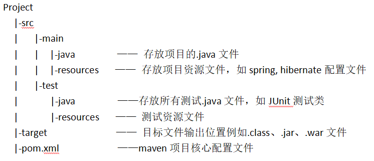

## Spring

Spring默认使用JDK动态代理，在类没有实现接口时使用CGLib  

#### AOP介绍
**参考文章：https://blog.csdn.net/u013789656/article/details/80938217?depth_1-utm_source=distribute.pc_relevant.none-task&utm_source=distribute.pc_relevant.none-task
https://www.cnblogs.com/Fantastic-Code/p/11593544.html**
AOP即面向切面编程，通常用于将频繁使用的功能代码封装起来，作为切面插入到需要的业务流程中，避免对业务流程的侵入。比如事务管理，性能监视，安全检查，实现日志。  
底层的实现是动态代理，有JDK动态代理和CGLib动态代理两种代理方式  

**AOP实现方式：**  
**参考文章：https://www.jianshu.com/p/f6ce9de9d2e6**
- XML配置中通过代理实现
- XML配置中通过<aop:config>实现，这种方法也有两种形式：使用<aop:aspect>标签定义切面将通知与切点对应；使用<aop:adviser>定义通知者（相当于切面）将通知与切点对应 
- 使用AspectJ注解方式

**相关术语：**    
- Aspect，切面，一般是一些通用的功能模块
- Advice，通知，是切面的具体实现方法，分为前置通知（Before），后置通知(AfterReturing)，异常通知AfterThrowing，最终通知（After），环绕通知(Around)，实现方法属于哪类，有具体的配置或注解指定
- Pointcut，切入点，实际的业务流程中需要插入切面的位置
- JoinPoint，连接点，程序运行时目标方法的信息都会封装到这个对象中，包含目标方法所在类，参数，执行返回值等。
- Target，目标对象，表示被切面通知的对象
- Proxy，代理对象，目标对象的代理，动态创建的，在目标对象的方法中加入切面实现的功能
- Weaving，切入，将切面切入到目标对象创建动态代理的过程，这个过程可以发生在编译期，类装载期和运行期

**几种通知的执行顺序：** 
Around --》Before --》目标方法 --》Around --》After --》AfterReturning --(如果抛出异常)》AfterThrowing  
After是无论方法是否抛出异常都要进行的处理  
AfterReturning在方法正常return才会进行的处理  

**Spring AOP与AspectJ的区别：**
- Spring是动态代理，AspectJ是静态代理，需要自己通过编译期编译

#### Spring声明式事务配置有几种
- 注解配置
配置事务管理器，开启注解事务，在对应的类或类的方法上加注解@Transactional
- 配置文件方式
传播特性配置，配置事务管理器，声明式事务AOP配置(表明哪些切点遵循传播特性的配置)

#### Spring中事务传播特性
**参考文章：https://blog.csdn.net/soonfly/article/details/70305683?depth_1-utm_source=distribute.pc_relevant.none-task&utm_source=distribute.pc_relevant.none-task**
Spring中共有七种事务传播特性，事务传播特性是指在有多个事务方法时，一个事务方法被另一个事务方法调用，它的事务如何进行
假设有事务方法A和B，其中A中调用了B，B不调用其他事务方法  

``` java
void A(){
    statement
    B();
}
void B(){
    statement
}
```

- PROPAGATION_REQUIRED，没有事务则开启事务，有事务则支持  
当调用B时，没有事务就开启事务，当先调用A开启了事务，A中调用B时，AB共用一个事务
- PROPAGATION_SUPPORTS，有事务则支持，没有事务就非事务执行  
当调用B时，没有事务就不再事务中执行，当先调用A开启了事务，A中调用B时，AB共用一个事务
- PROPAGATION_MANDATORY，没有事务抛出异常，有事务则支持事务  
当调用B时，没有事务就抛出异常，当先调用A开启了事务，A中调用B时，AB共用一个事务
- PROPAGATION_REQUIRES_NEW，方法单独执行时开启事务，如果有存在的事务，会将那个事务挂起，需要使用**JtaTransactionManager**作为事务管理器  
当调用B时，没有事务就开启事务，当先调用A开启了事务，A中调用B时，A的事务会被挂起，那么两个事务的回滚是独立的
- PROPAGATION_NOT_SUPPORTED，总是非事务执行，如果已经有事务，会挂起事务  
当调用B时，不开启事务，当先调用A开启了事务，A中调用B时，A的事务会被挂起
- PROPAGATION_NEVER， 不开启事务，有事务存在就抛出异常
当调用B时，不开启事务，当先调用A开启了事务，A中调用B时，会抛出异常
- PROPAGATION_NESTED，没有事务时按照REQUIRED执行，有事务时开启事务，与外层事务嵌套，内层事务失败只回滚内层事务，外层事务失败会将内外层都回滚，外层事务提交时，内层事务才完成提交  
当调用B时，不开启事务，当先调用A开启了事务，A中调用B时，B也开启一个事务，B失败只回滚B的操作，A失败时回滚包括B中的操作

**PROPAGATION_REQUIRED_NEW和PROPAGATION_NESTED的区别：**  
两种传播特性下，在存在事务时都会再开启一个事务，但NESTED下，外层事务回滚会包括内层事务操作，REQUIRED_NEW下，内外层分离，外层事务回滚不影响内层事务已经进行的操作  


## Nginx
**参考文章：https://www.php.cn/nginx/423510.html
https://developer.51cto.com/art/201910/605110.htm**  

**Nginx的反向代理：** 客户端把请求发给Nginx，Nginx再将请求交给服务器处理，然后再把请求的响应转交给客户端。  
反向代理可以保证内网安全和实现负载均衡  
反向代理跟正向代理的区别是，正向代理的代理是介于客户和服务器之间的第三方，而Nginx的反向代理是属于服务端的设备，有服务端维护和设置。

#### Nginx负载均衡
- 根据权重确定随机选中概率
- 轮训，权重轮训
- 最小链接数，哪个服务器的链接数少，就分配给哪个服务器。
- IP hash，根据IP的Hash值对应到服务器，保证同一个IP总能由同一个服务器提供服务，可以解决session共享问题
- url hash，根据url的Hash值对应到服务器，同一个地址访问总由同一个服务器响应，缓存效率更高

#### 四层负载均衡与七层负载均衡区别
四层负载均衡基于TCP和UDP协议，通过IP+端口号接受请求并转发到服务器。  
七层负载均衡基于HTTP协议，通过url或主机名接收请求并转发到服务器。  

## Dubbo Dubbox
**参考文章：[dubbo负载均衡与容错](https://www.cnblogs.com/xhj123/p/9087532.html)
https://blog.csdn.net/GoldWashing/article/details/82316089**  

#### Dubbo提供的功能
**基于接口的远程调用，容错，负载均衡和自动的服务注册与发现**

#### Dubbo 容错
- Failover，失败重试，设定最大重试次数
- Failfast，快速失败，失败了之后，立即报错
- Failsafe，调用出现异常时，直接忽略，这种模式可以用于写入日志
- Forking 有请求是同时向多个提供者发出请求，只要有一个成功返回就算是成功调用。浪费资源，用于实时性要求比较高的场合
Dubbo的容错机制还可以定制，根据提供的接口Cluster进行自定义策略

#### Dubbo负载均衡
**参考文章：[dubbo四种负载均衡策略](https://blog.csdn.net/qq_23864915/article/details/90524467?depth_1-utm_source=distribute.pc_relevant.none-task&utm_source=distribute.pc_relevant.none-task)
**
- Random，权重随机，根据权重确定随机选中概率
- RoundRobin，轮询，基于加权的轮训算法，在轮询时，它们收到的请求数接近或等于它们的权重比。
- LeastActive，最少活跃调用，请求优先分配给活跃数小的服务提供者。刚开始每台提供者的活跃数都为0，每收到一个请求，活跃数加1。最小的活跃数有多个提供者时，根据权重确定选择谁。
- ConsistentHash，一致性hash，根据参数hash确定分配，相同参数的请求总是发到同一个提供者，缺省只对第一个参数hash，当某一台机器挂了，根据虚拟节点把请求平摊给其他提供者，不会给系统带来很大的震荡。

#### Dubbo中服务注册与发现流程
- 服务提供方启动后，会向注册中心注册服务提供，在zookeeper中该服务目录的provider下建立节点
- 服务调用方启动后，会向注册中心订阅服务，在zookeeper中该服务目录下的consumer下建立节点
- 注册中心会返回服务提供者列表给服务的调用者
- 有新的服务提供方变动，会通知到注册中心，然后注册中心将通过长连接推送变更数据给调用者
- 在服务的调用端，通过软负载均衡算法，从提供者列表中选择一个进行调用，如果调用失败，再选另一个调用


#### dubbo与dubbox的区别
dubbo是阿里淘宝网开源的一个RPC框架，dubbox是当当网基于dubbo的一个扩展版本  
- **dubbox支持REST风格（HTTP+JSON/XML）的服务调用**
- 支持基于Kryo和FST的高效序列化实现(**丰富了序列化的方式**)
- 支持基于Jackson的JSON序列化
- 支持介于Tomcat的http remoting，用于逐步取代dubbo中的Jetty
- 升级Spring至3.0，有2.0升级到3.0，减少了可能发生的版本冲突
- 升级Zookeeper
- 支持完全基于Java代码的dubbo配置，基于Spring的Java Config


#### Dubbo与Spring Cloud 比较
- dubbo 传输远快于springcloud  
- dubbo服务提供方与调用方接口依赖方式太强：我们为每个微服务定义了各自的service抽象接口，并通过持续集成发布到私有仓库中，调用方应用对微服务提供的抽象接口存在强依赖关系
springcloud REST调用方式相比RPC更为轻量化，服务提供方和调用方的依赖只是依靠一纸契约，不存在代码级别的强依赖。


## RPC
**参考文章：https://blog.csdn.net/weixin_45191798/article/details/97620171**
RPC （远程过程调用）
本地调用方式时，先将相关参数(代表函数的call ID和函数参数)序列化，然后通过网络传输到服务端，在服务端反序列化后，调用目标方法进行处理，处理的结果再序列化后返回到调用端。

#### RPC的几个关键点
- 代理，由于调用的过程在远端，不能直接使用目标主机的对象，本地需要实现代理，隐藏与远程主机的通信，反序列化等细节。可以使用JDK的动态代理，或者第三方CGLib动态代理。
- 序列化，传输需要字节流的数据，所以本地的参数需要经过序列化，可以使用jdk的序列化方法，或者使用第三方序列化方法，比如hession
- 传输，数据需要通过通信在调用端和服务的提供端传输，需要选择合适的传输方式，有无阻塞，能否复用等。
- 实例化，传输的数据在接收端需要反序列化为相应的对象

**需要注意的点：**
- 序列化速度，Dubbo默认使用的是速度较快的Hession
- 序列化后数据大小，可以通过哈夫曼编码减小数据的大小，保证更快地传输
- 网络传输速度，它直接决定了服务响应的速度，使用网络传输速率更高方式，尽量支持多线程，高并发。Dubbo使用Netty（非阻塞，多路复用IO）

#### RPC与REST
**参考文章：https://blog.csdn.net/u014590757/article/details/80233901?depth_1-utm_source=distribute.pc_relevant.none-task&utm_source=distribute.pc_relevant.none-task**  
RPC（Remote Procedure Call Protocol）是一种远程服务调用的框架，调用端通过接口调用方法，过程中将方法ID和序列化后的采纳数传递到服务提供端，有服务提供短完成方法执行，然后返回结果，一般通过TCP进行数据的传输，在使用中就像调用本地方法一样  
REST（Representational State Tranfer）是一种软件架构风格，通过HTTP协议定义的方法（GET POST PUT DELETE）来执行对应操作，同时通过URI来定位资源，HTTP请求的处理方法即是我们要远程调用的方法

- 在使用上，RPC需要两端依赖同一个服务接口，客户端通过接口发起调用，而REST基于http，只关注服务端实现，客户端的调用方式没有过多的要求，客户端只需要通过HTTP方式调用，定位到服务端的方法上
- REST方式对平台的依赖较小，因为是通过HTTP来实现的调用，可以方便的跨语言
- RPC一般通过TCP除数数据，相比REST的HTTP传输，数据包更小，速度更快


## Zookeeper

**参考文章：https://www.cnblogs.com/xinyonghu/p/11031729.html
https://zhuanlan.zhihu.com/p/44731983
https://zhuanlan.zhihu.com/p/75161633**

Zookeeper是一个分布式服务框架，它**可以作为一个集群的管理者**，是一个典型的分布式系统数据一致性解决方案，可以实现分布式系统的消息发布/订阅，负载均衡，命名服务，集群管理，分布式锁和分布式队列等  


#### Zookeeper集群工作方式
Zookeeper集群中会包含一个leader和多个follower和observer，其中leader能够处理读和写请求，follower和observer处理读请求，leader中写入的数据会同步到follower和observer中，只有数据在半数以上的服务器（不包括Observer）中写入才算成功写入  
当系统中leader故障后，会从follower中选举出leader  
observer和follower的区别是observer不参与系统的投票选举和“过半写成功”的写策略  

- Zookeeper通过TCP协议与客户端建立长连接，实现发送，接受请求，获取监听事件和心跳检测。
- 集群的服务器间会保持通信，通过ZAB协议实现数据的一致性
- Zookeeper是高性能的，且更适合读多写少的工作，应为可以在多个服务器上读，但是写操作需要在服务器间进行同步

#### Zookeeper特点
- 顺序一致性，有同一客户端发起的事务请求，会被按照顺序应用到Zookeeper中
- 原子性，所有事务请求结果要么应用到全部的Zookeeper服务器中，要么不应用
- 单一系统映像，客户端无论连接到哪一个Zookeeper器中，看到的服务端数据模型都是一致的
- 可靠性，一次更改请求被应用后，它的结果就是持久的，直到被下一次更改覆盖

#### 
- 一般使用奇数台服务器构建Zookeeper集群，原因是Zookeeper集群在**存在半数以上的服务器有效时是可用的**，在这种机制下，4台和3台机器构成的集群，其可靠性是一样的，都是只允许一台机器故障


#### Zookeeper提供的服务
- 文件系统
Zookeeper中采用树形的节点命名空间来管理数据，与文件系统不同的是每个节点都可以存储数据，并且Zookeeper的节点存在与内存中，可以提供高吞吐量和低延迟的访问服务，但不能用于存储大量数据，每个节点的**存储上限为1M**
- 通知机制，这是Zookeeper作为分布式服务框架的重要特性
Zookeeper允许客户端注册节点的监视（watch）事件，在注册watcher后，节点的变化会通知到相应的客户端，客户根据这些时间执行相应的业务逻辑

#### Zookeeper节点
- 持久节点
节点存储在Zookeeper中，即使与服务端的session会话结束也不会消失，除非主动释放
- 持久顺序节点
可以根据节点新建的时间进行自增排序的持久节点
- 临时节点
临时节点在Zookeeper服务器与客户端的session释放后会被清除
- 临时顺序节点
可以根据节点新建的时间进行自增排序的临时节点

#### ZAB协议
Zookeeper通过ZAB协议实现分布式数据一致性，ZAB协议工作在两种模式下，分别是恢复模式和广播模式
- 恢复模式，当系统启动时，或出现leader崩溃，中断等异常情况时，ZAB会工作在恢复模式，这种模式下首先会选举除leader，然后其他服务器与leader进行数据同步
- 广播模式，当有过半的服务器与leader实现数据同步时，会切换到广播模式，在该模式下，当leader收到事务请求，会将决议广播到其他的服务器进行投票，超过半数才会执行。非leader服务器在收到事务请求时会发送给leader处理

#### Zookeeper应用
 1. 注册中心，实现服务的注册和订阅
 2. 集群管理，记录集群的退出和加入
 3. 命名服务，实现
 4. 配置管理，存贮全局的配置，当配置放生改变时，通过watcher机制通知到相关的客户端
 5. 分布式锁

客户端需要时，在对应服务的目录下创建一个临时顺序节点，若节点顺序在最前则拥有锁，可以调用服务，若不是最前则监视前一个节点，当前一个节点释放锁后被清除，对应客户端会收到通知，然后获得锁
- 消息队列
在持久顺序的znode中存储消息，实现队列的功能

## MyBatis

#### Mybatis中的mapper接口为什么不需要实现类
在Mybatis中，我们操作数据库时，一般针对一个表会建立一个xxxMapper.xml文件,然后定义一个xxxMapper接口，在使用时便可直接新建接口对象进行相应的数据库操作，并没有定义接口的实现类。  
该现象背后的原理是动态代理，在使用动态代理时，并不一定要接口实现类作为被代理类  
通过Proxy获得代理对象后，重写InvocationHandler的实现类的invoke方法，根据不同的method的名字可以对应的调用xxxMapper.xml中定义的数据库操作。相当于在invoke中实现方法，不需要调用接口实现类的方法

#### 动态SQL
通过一些条件语句等动态的调整SQL语句的内容  
通常使用的标签有if where （choose when otherwise） set trim


## SpringMVC
**参考文章：https://blog.csdn.net/a745233700/article/details/80963758?depth_1-utm_source=distribute.pc_relevant.none-task&utm_source=distribute.pc_relevant.none-task**  

SpringMVC是MVC设计模式的一个轻量级实现框架，基于Java编写。实现了web应用模块的清晰解耦

#### SpringMVC处理流程
1. DispitcherServlet前端控制器接受请求
2. 由处理映射器HandlerMapper映射请求，得到处理器及处理器拦截器一并返回给DispatcherServlet
3. DispatcherServlet调用HandlerAdapter处理器适配器
4. 处理器适配器HandlerAdapter调用具体处理器Handler
5. Handler返回ModelAndView，最终返回给DispatcherServlet
6. DispatcherServlet对调用视图解析器ViewResolver对ModelAndView进行解析
7. ViewResolver返回具体的view
8. DispatcherServlet对view进行渲染，填充model到view中
9. DispatcherServlet响应用户

#### SpringMVC拦截器
拦截器有两种实现方式：
- 实现HandlerIntercepter接口
- 继承HandlerInterceptor接口的实现类，比如Spring中提供的HandlerInterceptorAdapter抽象类
编写HandlerIntercepter接口，实现其中的preHandle，postHandle和afterCompletion方法，实现需要的业务逻辑，比如登录验证等
在XML配置文件中配置拦截的请求
- preHandle，在Controller执行前，返回boolean类型，如果返回false，请求结束，返回true才会调用接下来的Interceptor和Controller。其执行顺序为声明顺序
- postHandler，在Controller执行后调用，在ModelAndView渲染之前执行，其执行顺序与preHandler相反，相当于"((Controller))"这种括号匹配
- afterCompletion,在请求结束后执行
拦截器可以有多个，根据声明顺序链式调用

#### SpringMVC中的常用注解
**参考文章：https://www.cnblogs.com/leskang/p/5445698.html**  
- Controller，用于注解controller类，表明其中定义了一下处理请求的方法
- RequestMapping，用来指明方法与请求地址的映射，可用于方法或者类上，常用参数是value（地址）和method（请求的方法）
- Resource和Autowired，实现bean的注入，Autowired是按照类型byType装配依赖的对象，Resource默认按照byName装配对象
- ResponseBody，表示方法的返回参数直接放入到http响应体response Body中，适用于返回json，xml等格式的数据
- RequestParam，用于在后台控制层获取参数，获取请求体中的数据，用来处理Content-Type: 为 application/x-www-form-urlencoded的数据
- @RequestBody，获取在请求体中的数据，用来处理Content-Type: 不是 application/x-www-form-urlencoded的数据，力图json，xml格式
- PathVariable，放在方法形参前，获取路径url中的参数
- RestContrller，ResponseBody和Controller的结合体


## Maven
**参考文章：https://blog.csdn.net/happydecai/article/details/80492212**  
Maven是一个项目管理和综合工具，用于完成项目构建、依赖管理和项目信息管理  
通过使用Maven，可以实现项目的分模块构建，方便的依赖管理，可以进行依赖的传递和继承  

**Maven的gav坐标：**
- groupId，组织名称
- artifactId，项目名称
- version，版本

#### Maven主要功能
- 依赖管理
- 多模块构建
- 一致的项目结构
- 一致的构建模型和插件机制

#### Maven优缺点
**优点：**  
- 简化依赖管理
- 使用简单，一般的使用通过 mvn clean package 命令即可满足
- 便于项目升级门不关事项目本身还是依赖
- 便于多模块开发，一个模块发布到仓库即可，其他模块依赖时可以直接在仓库中更新
- 支持插件来做功能扩展

**缺点：**  
- 采用约定优于配置的策略，出现问题时调试不方便
- 国内有些仓库无法访问

#### Maven依赖范围
**参考文章：https://www.sohu.com/a/212704477_100012573**  

- compile：编译依赖，默认的依赖方式，在项目和测试的编译和运行阶段有效，如spring-core等jar
- test：测试依赖，在测试用例的编译和运行阶段有效，如JUnit
- provided：对编译和测试有效，不会打包到发布包中，如servlet-api，一般工程运行都使用容器的servlet-api
- runtime：只在运行测试用例或实际运行时有效，如jdbc驱动jar包
- system：不从Maven仓库获取该jar，而是通过systemPath指定位置
- import：用于一个dependencyManagement对另一个dependencyManagement的继承

#### Maven生命周期
Maven的生命周期是对构建工程的过程的抽象，可以理解为构建工程的步骤  
Maven有三套生命周期，它们是相互独立的
- clean lifecycle，在进行真正的构建之前所做的清理工作，包括删除target目录
- default lifecycle，构建的核心部分，编译、测试、打包、部署等
- site lifecycle，生成项目站点，发布站点

#### 使用mvn clean package进行打包时，完成了哪些动作
clean周期的clean，default周期的package

#### Maven工程结构


