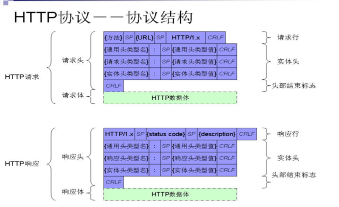

## 网络5层和7层模型
应用层（HTTP，FTP，SMTP，DNS），传输层（TCP，UDP），网络层（IP），链路层（ARP，以太网），物理层  
应用层（HTTP，FTP，SMTP，DNS），表示层（数据编码与加密），会话层，传输层（TCP，UDP），网络层（IP），链路层（ARP，以太网），物理层  

**网络层：** 网络层负责数据的选路和转发，选择通讯路径中的中间节点

网络层通过IP寻址一台机器，链路层通过MAC寻址一台机器，而ARP（地址解析协议）是通过IP寻找MAC地址的过程
**ARP：** IP在同一个内网中时，在其中广播IP地址，其他机器收到后与自己的IP地址比较，如果相同则返回自己的MAC地址，如果不在同一个内网，在通过IP定位到相应的网络中，在进行MAC的解析

## HTTP

#### http报文组成

http报文分为请求报文request和响应报文response

**参考文章：https://www.cnblogs.com/superfeeling/p/11561340.html
https://blog.csdn.net/u013087513/article/details/49465597**  

**请求报文：**
- 请求头
包含请求行和请求头部
- 请求体
包含请求数据

总的来说请求报文包含：请求行，请求头部，空行，请求数据

**请求行：** 由请求方法字段，请求url字段，http版本字段三部分组成，用空格间隔 如GET /index.html HTTP/1.1  
请求方法有GET，POST，HEAD(http 1.0定义)， PUT，DELETE，HEAD，OPTIONS，TRACE，CONNECT（http 1.1新增）  
GET请求，数据放到url中，有长度限制，不安全    
POST请求，数据放到body中，没有长度限制，更安全  
**请求头部：** 请求头部按照键值对形式记录数据，**包含的是客户端的环境描述，请求的主机地址，包含请求数据时还要有请求数据的描述**
- user-agent 用户代理，发出请求的浏览器类型
- host，请求资源所在服务器
- Referer：发出请求的页面的URL
- Accept 客户单可接受的内容列表
- Accept-Encoding 优先内容编码
- Accept-Language 优先语言，自然语言

- content-Type:text/html，表示报文主题的对象类型
- Content-Encoding，报文编码
- Content-Length，报文长度

**空行：** 表示请求头的结束  
**请求体：** 在POST方法中需要向服务端提交数据，数据包含在请求体中作为请求数据，跟这部分数据相关的首部有Content-Type，Content-Length等content相关字段

**响应报文：**
- 响应头
包括响应行和首部字段
- 响应体
包含响应的具体数据

总的来说包含：状态行，响应头部，响应正文

**状态行：** 包含http版本，状态码，状态码的文本描述 如 HTTP/1.1 200 OK  
**响应头部：** 类似请求头部的键值对类型数据 **包含服务器描述，响应数据描述**
- content-Type:text/html，表示报文主题的对象类型
- Content-Encoding，报文编码
- Content-Language，报文语言
- Content-Length，报文长度

**响应正文：** 包含响应请求的数据，可以是html格式，json格式，通过content相关首部来定义相关的属性

**状态码：**
- 1XX，指示信息--请求已被接受
- 2XX，成功--请求已被正确处理
- 3XX，重定向--需要进一步操作
- 4XX，客户端错误--请求地址，数据有误或者请求无法实现
- 5XX，服务端错误--服务端未能实现合法请求
常见状态码：  
- 200，OK
- 400，bad request
- 403，Forbidden，服务端收到请求，但拒绝服务
- 404，Not Found，请求资源不存在
- 500，Internal Server Error，服务器发生不可预期的错误
- 503，Server Unavailable，服务器当前不能处理请求，过一段时间可恢复正常

#### http报文首部有哪些属性（首部字段）
- cache-control 缓存控制
- connection 连接类型
Connection:keep-alive 表示TCP连接需要保持，不会在一次请求完成后断开TCP连接
- keep-alive 保持连接时间
- set-cookie 设置cookie

- content-Type:text/html，表示报文主题的对象类型
- Content-Encoding，报文编码
- Content-Language
- Content-Length
- Transfer-Encoding， 报文传输的编码类型

#### http各版本介绍
**参考文章：https://blog.csdn.net/qq_22238021/article/details/81197157
https://blog.csdn.net/qian_xiaoqian/article/details/53020319**  
- http/0.9
只能进行GET请求，只能进行html资源请求访问
- http/1.0
相对于0.9，增加了POST和HEAD方法，根据Content-Type设置可以传输多种数据格式  
但是在1.0版本每次TCP连接仅能发送一个请求，不支持keep-alive,为了避免每次请求都建立连接，有些浏览器加入了非正式的connection字段来建立长连接
- http/1.1
新增了方法PUT，DELETE，OPTIONS，PATCH  
支持了持久连接，TCP连接默认不关闭，可以被多个请求复用，不用声明Connection:keep-alive  
目前，对于一个域名，大多数浏览器支持同时最多存在6个连接  
加入了管道机制，多个请求可以连续发送，不用等前一个请求的响应完毕，但是**服务器还是按照顺序回应请求，前一个请求回应完成再回应下一个请求，但请求的处理不用按照顺序** 
服务端对请求的处理仍然要按照顺序处理，如果前面的请求响应很耗时，后面的请求需要等待处理，造成**队头阻塞**，这种情况可以通过多开持久连接来缓解  

**此时如何确定响应属于哪个请求：** 虽然可以一起请求，但响应是按照顺序回应的，先发送的请求会先被回应  
根据Content_Length可以确定http响应体长度，到达一定长度表示一个http数据报接受完毕  
**分块传输：** 如果一个响应的数据需要准备比较长时间，使用Content_Length要等所有数据准备完毕才能发送，这时也可以采用**分块传输**的方法，不使用Content_Length,使用Transfer-Encoding: chunked来标识当前是分块传输，数据块之前都有一个16进制数值表示块的大小，最后一个为0表示传输完毕
- http/2.0
为了缓解1.1版本处理效率低的问题，2.0版本中服务端也可以并发的处理请求，不必按顺序处理，没有了队头阻塞的问题  
在http协议中，请求头部和响应头部没有真正的数据，而且大都是重复的字段，2.0中在服务和客户端维护了一张表，以表的索引号来表示字段，减少了数据传输  
因为http/2.0不需要按顺序处理响应，那么就需要其他信息来确定请求与响应的对应，这里通过给发送的数据加上数据流ID来确定数据的顺序，同时规定，客户端ID为奇数，服务端ID为偶数  
2.0中允许信息推送，服务端可以在客户端没有请求的情况下向客户端推送信息  

#### http与https
**参考文章：https://blog.csdn.net/zhttly/article/details/82895713
https://www.jianshu.com/p/8b5350d373fe
https://www.cnblogs.com/jesse131/p/9080925.html
https://blog.csdn.net/qq_38289815/article/details/80969419**  

Http是明文的数据传输协议，协议数据未经过加密，会存在安全问题  
https中的数据会经过加密，可以认为是Http+ssl/tls的组合，https提供数据加密，双向身份校验，防篡改服务  
- http的默认端口是80，https的默认端口是443
- 在OSI网络模型中，https的加密是在传输层完成的

#### https连接建立过程
- 首先client向服务端发送建立https连接请求
- 服务端向客户端传输证书，其中包含公匙和一些其他信息(证书颁发机构，过期时间)
- 客服端进行证书验证(机构是否可信，是否过期),验证通过后，生成对话密匙，将对话密匙用公匙加密，发送到服务端
- 服务端用私匙解密数据，得到对话密匙，然后服务端和客户端就可以通过这个密匙通信

在这个连接建立的过程中，使用非对称密匙进行对话密匙的加密，而对话密匙是对称的  
**非对称密匙**是发布一个公匙，用户用公匙加密信息，而解密使用另一个私匙，相比于使用同一个密匙的**对称密匙**，其解密速度更慢  
所以SSL中，使用非对称密匙加密对话密匙，这样数据量很小，而对话密匙是对称的，用它来加密传输的文件，其精髓就是两套密匙  

#### https防篡改原理
首先，https加密数据，通过非对称密匙和对称密匙，可以实现客户端和服务端省份的双向校验。  
对于防篡改，在传输数据前，会对原文进行hash，生成一个**摘要**，通过概要不能复原数据，并且相同原文对应一个摘要，在数据传输时，将该摘要也加密传输，在另一端解密原文后，对应生成hash，与解密后的摘要对比，若不同说明数据被篡改。

#### https的缺点
- https的握手过程降低了响应速度
- https复杂的通信过程和加密解密会给服务端和客户端带来负担
- https的缓存更加难以实现
- 免费证书少，一般SSL需要钱

#### http/1.0和http/1.1
http1.0是短连接的，每一次请求都对应握手和挥手的过程，传输效率低  
http1.1是长连接，在一次握手之后可以进行多次请求，直到挥手断开连接  
http1.1中加入管道，在一次请求发送后不同等待响应，可立即发送第二个请求，但服务端的响应苏姚按照顺序返回，如果没有收到第一个请求，不会响应后面的请求  
这会造成请求的队首阻塞，在http/2.0中，响应不需要按照顺序。

## TCP

#### TCP和UDP的区别
- UDP只提供基本的数据传输服务和有限的校验，TCP提供可靠数据传输
- TCP是有连接的，UDP无连接
- UDP不保证数据的有序性和可靠传输，TCP可以保证有序性和数据可靠传输，通过序号，重传控制，校验和等手段保证这些性质
- TCP占用资源高于UDP，传输速度慢于UDP，UDP适用于要求高速传输的通信场合，比如网络视频会议，在线游戏等
- TCP是点对点通信，UDP可以实现一对一，一对多通信。
- TCP是面向字节流的数据传输，UDP是面向数据报的数据传输

#### TCP为什么是面向流的传输协议
UDP是面向报文的数据传输，原因是UDP从应用层接收到一个数据报，不管数据报的长度多大都放到一个UDP报文中进行传输  
TCP在接收到应用层数据报后，会根据情况将数据按照字节进行拆分，按照顺序包裹到多个TCP报文中进行传输，也就是报数据当成字节流来看待，而不以应用层的数据报为传输单位  
同时在接收端存在缓冲区，当接收端收到足够多个的连续TCP报文后，再进行加载处理，保证报文的有序性。

#### TCP三次握手和四次挥手
**参考文章：https://blog.csdn.net/qq_38950316/article/details/81087809**

**TCP主要首部信息：**  
- 源端口和目的端口，对应发送和接受方应用程序
- 序号seq和确认号ack，存放数据序号（标记数据段传输顺序）和确认号（一般是将收到的序号+1）
- 标志位 SYN，ACK，FIN等，仅在ACK为1时，确认号才有效
- 窗口大小 16bit，表示还能接受的数据
- 校验值

**三次握手：**  
首先客户端向服务端发送连接请求，SYN置1，带有序列号seq=x，然后状态变为SYN_SEND  
服务端收到请求后，创建连接，进行响应，SYN置1，ACK置1，带有序列号seq=y,确认号ack=x+1，然后状态变为SYN_REVD  
客户端收到响应后，ACK置1，发送序列号seq=x+1，确认号ack=y+1，然后状态变为established  
服务端收到信息后，状态变为established，连接完全建立

**为什么是三次握手：**  
- 三次握手可以保证服务端和客户端都可以确定对方能够正常的收发数据  
首先客户端向服务端发送一次数据，然后服务端进行响应，在这两次握手之后，客户端就可以确定服务端可以正常的收发数据，而服务端只收到了客户端数据，只能确定客户端可正常发送数据，不确定他是否可以正常接收自己的数据，所以需要第三次握手，客户端对服务端进行响应，服务端才能确定客户端的正常收发功能。  
- 三次握手可以防止无效连接，如果客户端向服务端发送的第一个连接请求因为较大延时没有及时到达服务端，客户端又重新发送连接请求，然后建立连接，这时第一个连接请求到达服务端，服务端以为是另一个连接请求，确认后新建了一个连接，但此时客户端已经放弃了这个连接，此时服务端的资源就被浪费了，如果是三次握手，客户端不返回确认就不会建立连接。

**四次挥手：**  
当客户端想要终止连接时  
首先客户端发送终止连接请求，使FIN置1，带有序列号seq=u,然后状态变为FIN_WAIT1  
服务端收到终止连接的请求后进行响应，使ACK置1，带有确认号ack=u+1和序列号seq=v，然后状态变为CLOSE_WAIT，客户端收到信息后状态变为FIN_WAIT2  
之后服务端在确定可以关闭连接时，发送关闭连接信息，使FIN和ACK置1，带有确认号ack=u+1和序列号seq=w，然后状态变为LAST_ACK   
客户端收到信息后，发送响应，使ACK置1,带有确认号ack=w+1和序列号seq=u+1，然后进行入TIME_WAIT等待2个MSL(最长报文段寿命)后closed连接  
服务端收到连接后状态立即变为closed  
一般服务端结束连接的时间要早于客户端  

**为什么客户端发送第二个报文段后还要等待2MSL：**  
为了保证连接的正常关闭，需要考虑最后的ack报文可能不能正常发送，如果服务端收不到响应，会重发FIN报文，此时客户端再次发送ACK，然后等待2MSL。MSL（maximum segment lifetime）是报文段的最长寿命，等待2MSL就是一个发送时间和一个回复时间。

**为什么握手是三次，而挥手要四次：**  
在握手时，服务端收到SYN请求时，会直接返回SYN+ACK响应，但在终止连接时，服务端还有未发送完毕的数据，所以只能先回复ACK数据包，等数据发送完毕后，再发送FIN数据包，所以要多一次通信。

#### TCP滑动窗口协议
**参考文章：https://www.cnblogs.com/coder-programming/p/10627746.html
https://www.zhihu.com/question/32255109**  
滑动窗口协议是一种对传输层进行**流控制（数据传输控制）**的协议，接收方通过告知发送方自己的窗口大小，从而控制发送方的数据传输速度，防止数据发送速度过快  

**发送窗口：**发送方数据从左到右分为四个部分
1. 已发送并已经收到ACK
2. 已发送但收到ACK
3. 未发送但可以发送
4. 未发送且不能发送
**其中第2,3部分数据属于发送窗口**

**接受窗口：**接收方数据分为三个部分
1. 已确认接收
2. 未接收但可以接收
3. 不准备接收
**其中第2部分数据属于接收窗口**

当发送窗口最左端数据接收到ACK，窗口向右滑动  
当接受窗口最左端数据接收并发送确认后，窗口向右滑动  

**ACK报文中包含的关键数据：**
- seq，期望收到的下一个数据包序号n，这表示前n-1个数据都已经被正确的接受，如果当前收到的数据序号为10，且前10个数据都已正确接受，那此时的n就是11，假如7-9的数据还没有收到，10号数据会被存储，但依然会先请求n=7号数据  
- 当前窗口大小m，当知道接收端窗口大小m，发送端便可以计算出接收端缓存还能接受的数据个数，从而调节数据的发送，比如发送端将要发送序号为x的数据，那么接收端还能接受的数据包个数为m-(x-n)

**这是滑动窗口的基本原理，它一方面均衡了数据发送的速度，一方面保证了数据的有序传输，因为窗口是在有序的数据序号上滑动的**  

发送端窗口的第一个序号一定是期望收到的数据序号，接收端窗口的第一个序号之前的一定都是已经完全接收的，窗口中的数据是希望接受的，窗口后面的是不希望接收的

如果接收方发送的窗口大小为0，表明接收方当前不能接收数据，发送方停止发送数据，接收方可以接受数据时会向发送方发送确认，但如果这个报文段丢失，会造成两端都等待型号才能死锁，为了应对这种情况，TCP中设定了persist timer持续定时器，当定时器超时时会发送一个探测报文段，接收方在确认报文中带上窗口值  

#### TCP拥塞控制
**参考文章：https://blog.csdn.net/qq_38623623/article/details/81290265**  
TCP的拥塞控制包括四部分内容：慢启动，拥塞避免，快速重传和快速回复  
发送端向网络中一次写入的数据量，成为SWND（send window），同时TCP是按报文段来发送数据的，SWND的大小直接影响一次能发送的报文段数量  

发送方维持了一个阻塞窗口CWND，它的大小取决于网络的拥塞程度，是动态变化的  
- 慢启动
慢启动算法，刚开始设定CWND为MSS（最大报文段大小），后续**收到一个报文段回复**，就把拥塞窗口最大增加一个MSS值，为了防止过度增长，会设置一个慢启动门限ssthreth，当CWND<ssthreth时，按照慢启动算法增长，当CWMD>ssthreth，使用拥塞控制算法，等于时两个都可以用。
**这里的“慢”不是增长速度慢，而是开始发送时CWND只能发送一个报文段进行探测，慢启动的增长速度是指数级的**
- 拥塞避免
使拥塞窗口缓慢增长，每经过**一个RTT往返时间**CWND+1，这种增长速率慢很多

在**慢启动**和**拥塞避免**阶段，只要发送方判断出网络拥塞，就会把慢启动门限值设为当前CWND的一半（不小于2 ），然后将CWND置1，重新从慢启动阶段开始  
这时会大幅减少向网络中发送的数据，使网络中拥塞的分组得到传输  
**发送端判断拥塞的根据：**
1. TCP重传定时器超时 2. 收到重复的确认报文
- 快速重传
接收方每收到一个失序的报文段就立即发出重复的报文确认，发送方收到每收到3个重复的确认报文就理解重传数据，无需等到定时器超时
- 快速恢复
配合快速重传算法，当收到重复的确认报文时，包重启动门限设为CWND的一般，然后CWND等于门限值，进入拥塞避免阶段  而不是CWND置为1，进行入慢启动阶段，因为能收到重复确认报文，说明网络未必拥塞，这是在TCP较高版本中才用的方式，慢启动只在TCP启动阶段出现

**拥塞窗口和接收方窗口共同决定了发送窗口的大小**，首先使发送窗口等于拥塞窗口，然后考虑接受方窗口可能会减小  

#### TCP丢包怎么解决
首先，TCP协议有如下规定
- 数据分片，发送端会对数据分片，接收端需要重组数据
- 到达确认，接收端接收到数据后，会根据数据序号向发送端发送一个确认
- **超时重发**，发送方在发送数据后设置超时定时器，在一定时间后没有收到确认会重发数据
- 滑动窗口，接受和发送方都会有数据窗口

通过超时重发机制可对丢失数据进行重发，但仍然要等待到一定时间，TCP有一种**快速重传机制**，当接收方收到的数据包序号大于期望的序号时，表明有间隔，那么它会发送三个冗余的ACK，客户端收到后，不需要等待定时器过期，直接重传丢失的报文段

## cookie，session和token
http是无状态协议，当需要记录客户端状态时，可以使用cookie，cookie包含在http的请求头部中  
cookie用于记录用户访问信息，存储在用户端。每次访问对应的域时需要带上cookie，cookie存储的信息会造成网络传输上的负担。  
session可以减轻这种情况，客户端向服务端发起请求后，服务端会建立一个session（会话），存储客户的访问信息，这样在cookie中只需存储一个JSESSIONID信息，服务器收到该ID便可确认客户的身份，session是存储在服务端的。  
**区别：**
- cookie存储在客户端，session存储在服务器上
- cookie不是很安全，可能被截获分析
- session适合保存复杂的数据类型，而cookie是保存ascii码，保存复杂内容不太方便

客户端禁止cookie时，为了表示客户端，会使用url重写，在url增加后sid=xxx
session可以放在文件，内存或数据库中。  
TOMCAT中session在不活跃时默认生命周期是30分钟  

** 参考文章：https://www.cnblogs.com/moyand/p/9047978.html**
在使用session时，服务器需要保存所有的session ID，在集群服务中还存在session id的共享问题  
token可以解决这个问题，服务器不需要再存储session id，而是给登录后的用户颁发一个token作为其身份标识， 其特别之处是使用一个密匙对用户id进行加密，服务端通过同一个密匙对token进行解密，这样通过token的加密解密替代了保存session id。常用的加密算法有SHA-256  

## 从输入url到显示页面都发生了什么
- DNS解析
根据域名获得IP地址
- 创建TCP连接
TCP三次握手
- 提交http请求
- 服务端处理请求并返回响应
- 浏览器收到响应报文
- 浏览器渲染展示页面